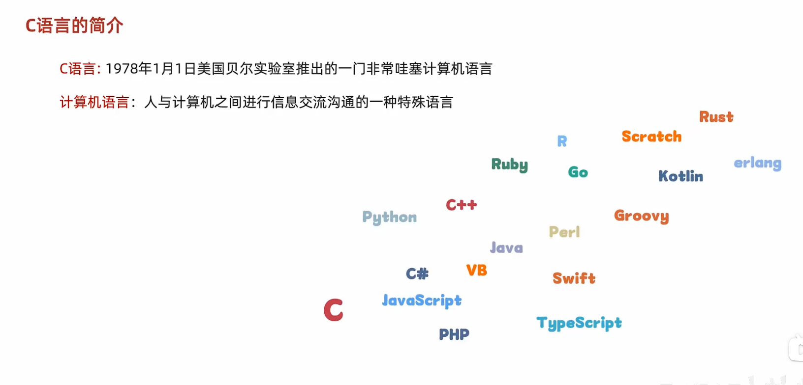
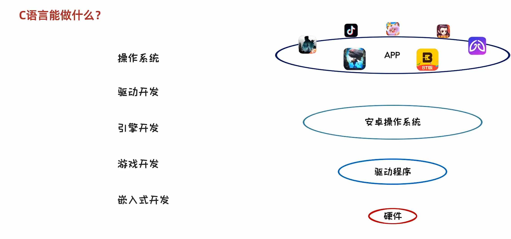
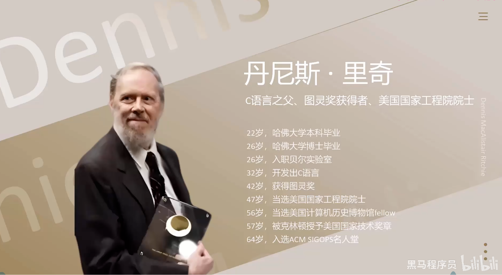
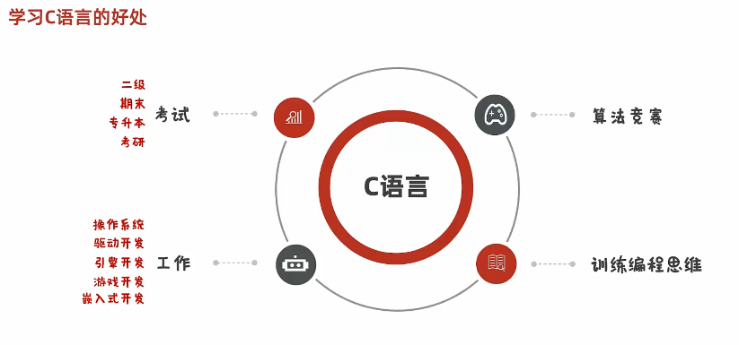
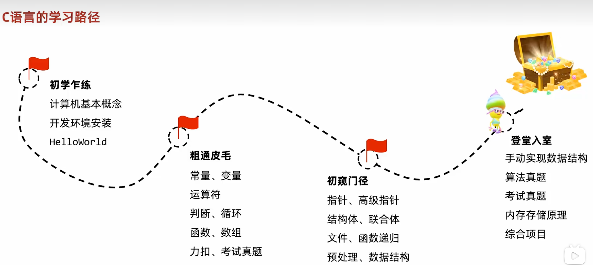
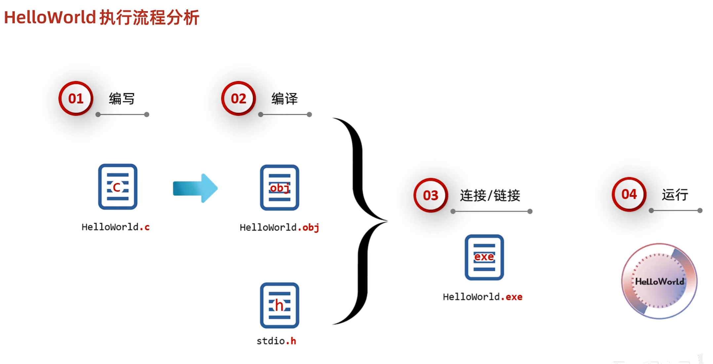

# 一.介绍
- 
- C语言：1978年1月1日美国贝尔实验室推出的一门计算机语言
- 计算机语言：人与计算机之间进行信息交流和沟通的一种特殊语言

## 1.C语言能做什么
- 
- 操作系统
- 驱动开发
- 引擎开发
- 游戏开发
- 嵌入式开发

## 2.C语言之父
- 
- C语言之父:丹尼斯·里奇

## 3.C语言好处
- 

## 4.C语言的学习路线
- 

# 二.环境搭建

# 三.第一个程序

## 1.HelloWorld程序分析
```C
#include <stdio.h>	 

int main() {
	printf("HelloWorld\n")
	return 0;
}

逐行分析
# include 引入提头文件专用关键字
<>用来包裹库，头文件名
stdio.h:使用头文件，因为程序中使用了printf()函数，必须使用头文件
    
std:标准 standard
i :input输入
o:output:输出   
    
int：main函数的返回值为整型
main:整个程序的主入口。任何.C程序，有只有一个main函数
printf();C语言向屏幕输出字符使用的函数
printf("HelloWorld!!\n"):向屏幕输出一段HelloWorld:待输出的字符内容。\n换行。
return 0；return返回，C程序要求，main函数要有返回值，借助return 0；实现 0成功返回非0失败 因为int 
返回整型
```
## 2..HelloWorld运行分析



完成C语言运行，分为一下四步骤，

1. 预处理:简单理解，就是先找到#include后面的<stdio.h>这个文件
2. 编译:把C文件编译成二进制文件后缀名为obj
3. 连接/链接:把预处理找到的h文件，编译之后的obj文件打包在一起，产生exe文件
4. 运行:运行exe文件

---

# 四.计算机存储规则

## 4.1. 在计算机中任意数据都是以二进制存储的

- 

# 五.进制之间的转换

## 5.1. 怎么来的

## 5.2 代码中怎么书写

## 5.3. 进制之间的转换


