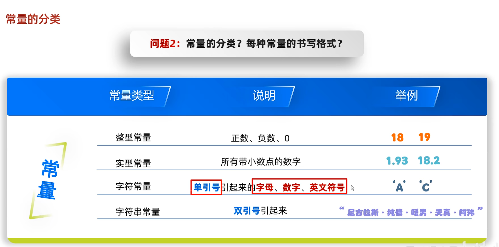
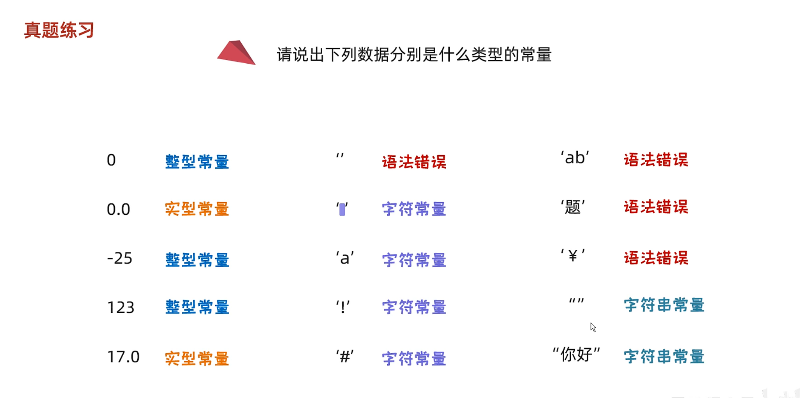
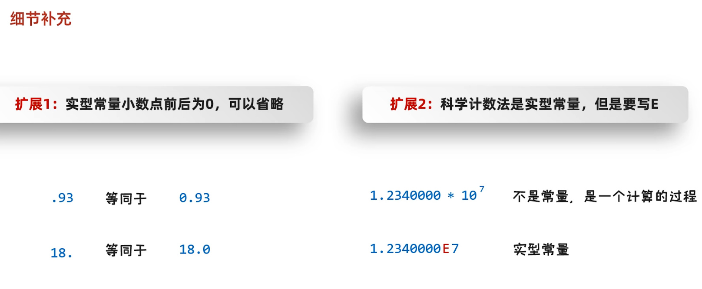
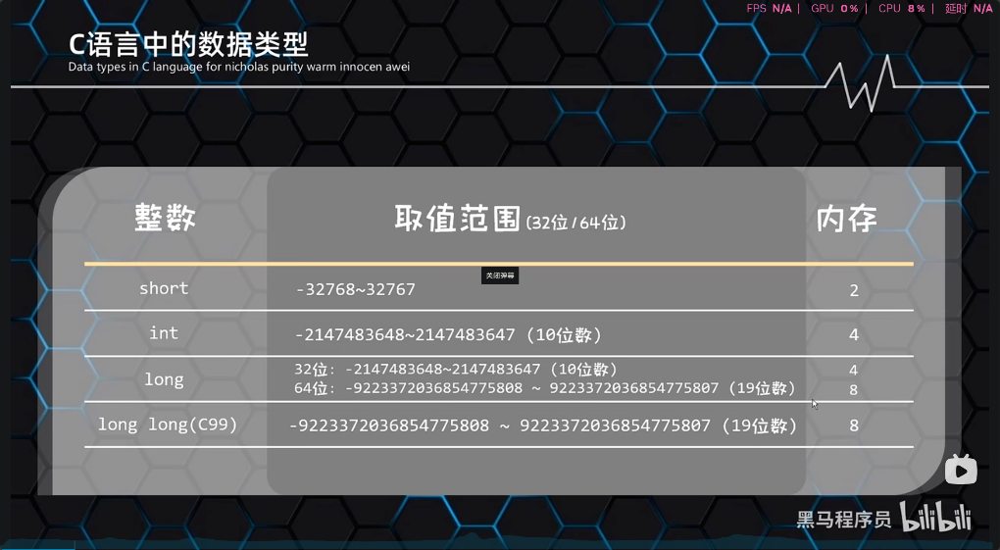

# 一.注释

## 1.1. 什么是注释
- 程序中解释声明性的文字

## 1.2. 注释的分类

  ```c
  //单行注释
  ```

  ```c
     /*
        多行注释
     */
  ```
- 注释的作用
  - 提高代码的阅读性

## 1.3.拓展
  1. 注释的快捷键：ctl + k,ctl + c/u
  2. 注释擦除：注释内容，不参与运行
  3. 注释的嵌套：最好不要嵌套

---

# 二.关键字
## 2.1.什么是关键字
  - 关键字：被C语言赋予涵义的英文单词
## 2.2. 关键字的特点
  - 关键字的字母全部小写
  - 常用的代码编辑器，对关键字有特殊颜色标记

---

# 三.常量
## 3.1.什么是常量
- 常量：在程序执行过程中，其值不能改变的数据
## 3.2. 常量的分类·
- 

| 常量类型   | 说明                             | 举例         |
| ---------- | -------------------------------- | ------------ |
| 整型常量   | 整数 负数 零                     | 18 19        |
| 实型常量   | 所有带小数点的数字               | 1.96 2.5     |
| 字符常量   | 单引号引起来的字母，数字英文符号 | 'a'  'A'     |
| 字符串常量 | 双引号引起来                     | “HelloWorld” |

## 3.3.细节补充
3. 

4. 

## 3.4输出常量

```
printf(参数1，参数2);
参数1：输出内容最终也是，以字符串形式体现(必填)
参数2：填补的内容(选填)
```


5. 


| 格式控制符/占位符 | 说明 |
| ----------------- | ---- |
| 整型              | %d   |
| 实型              | %f   |
| 字符              | %c   |
| 字符串            | %s   |

## 3.5输出并换行


| 操作系统           | 换行符 |
| ----------------- | ----   |
| windows           | \r\n   |
| mac               | \r     |
| Linux             | \n     |

7. 总结
   - 如何输出多个常量
     - 利用占位符的形式输出
     - 占位符和填写的数据要一一对应
   - 如何写换行符
     - 直接写\n即可
---

# 四.变量

## 4.1变量三要素

```C
1. 变量名:用来在程序中使用
2. 变量类型：开辟内存空间大小
3. 变量值：  存储实际数据
```

## 4.2. 变量怎么定义

```C
数据类型 变量名 = 变量值;
int a = 20;
```


## 4.3.变量如何使用

```C
    赋值/修改值        a = 20
    获取值             直接使用
```

## 4.4. 变量使用细节

   - 先定义在赋值
   - 数据类型 变量名 = 数据值;(定义 + 赋值)

## 4.5.变量的注意事项

   - 变量里面只内存一个值
   - 变量名不允许重复定义
   - 一条语句可以定义多个变量
   - 变量在使用之前一定要进行赋值
   - 变量的作用范围

# 五.数据类型

## 5.1.C语言中数据类型的作用
- 作用1：变量中能存储什么类型的数据
- 作用2：存储空间的大小

- 整数


- 要求
  - 掌握如何定义四种整数类型的变量
  - 张数类型的变量分为:short,int long.long long(C99)
  - 不同的数据类型所表示范围和内存大小都不一样，由编译器来决定的，可以用sizeof
    来确定，遵守一个原则：short <= int <= long <= long long
  - C语言中整数默认为int整型的
  - 可以和unsigned组合，定义一个无符号的整数，打印时占位符用%u

| 整数(一般情况下)        | 取值范围(32位/64位) |   内存     |
| -----------------  |  ----     |  ----      |
| short              | -32768 ~ 32767      | 2 |
| int                | -2147483648 ~2147483647(10位数) |   2 |
| long               | 32位: -2147483648 ~ 2147483647(10位数) <br>64位：-92233720366854775808 ~ 9223372036854775807(19位数) | 4<br>8 |
| long long(C99)     | -92233720366854775808 ~ 9223372036854775807(19位数) |   8 |

# 六.标识符


# 七.键盘录入

