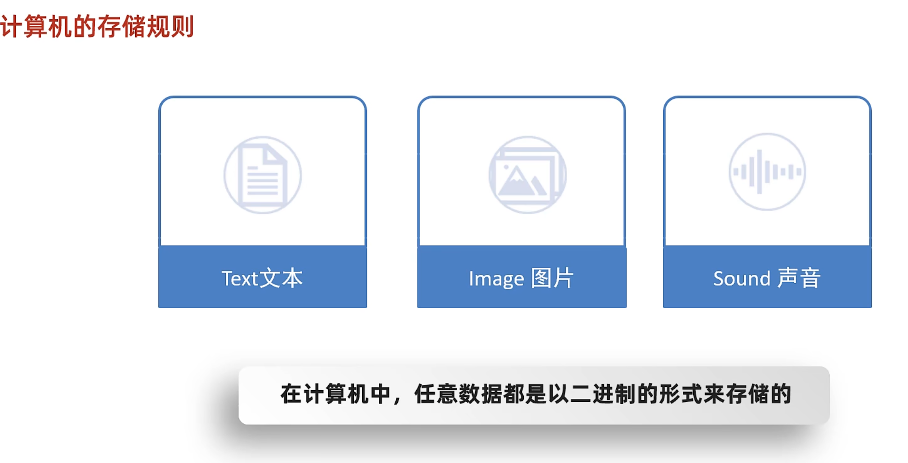

# 第2章-核心语法

## 一.注释
### 1. 什么是注释
- 程序中解释声明性的文字
### 2. 注释的分类
  ```c
  //单行注释
  ```

  ```c
     /*
        多行注释
     */
  ```
- 注释的作用
  - 提高代码的阅读性

### 3.拓展
  1. 注释的快捷键：ctl + k,ctl + c/u
  2. 注释擦除：注释内容，不参与运行
  3. 注释的嵌套：最好不要嵌套

---

## 二.关键字
### 1.什么是关键字
  - 关键字：被C语言赋予涵义的英文单词
### 2. 关键字的特点
  - 关键字的字母全部小写
  - 常用的代码编辑器，对关键字有特殊颜色标记

---

## 三.常量
### 1.什么是常量
- 常量：在程序执行过程中，其值不能改变的数据
### 2. 常量的分类·
- 

| 常量类型   | 说明                             | 举例         |
| ---------- | -------------------------------- | ------------ |
| 整型常量   | 整数 负数 零                     | 18 19        |
| 实型常量   | 所有带小数点的数字               | 1.96 2.5     |
| 字符常量   | 单引号引起来的字母，数字英文符号 | 'a'  'A'     |
| 字符串常量 | 双引号引起来                     | “HelloWorld” |

### 3.细节补充
3. 
4. 

5. 

| 格式控制符/占位符 | 说明 |
| ----------------- | ---- |
| 整型              | %d   |
| 实型              | %f   |
| 字符              | %c   |
| 字符串            | %s   |

6. 

| 操作系统           | 换行符 |
| ----------------- | ----   |
| windows           | \r\n   |
| mac               | \r     |
| Linux             | \n     |

7. 总结
   - 如何输出多个常量
     - 利用占位符的形式输出
     - 占位符和填写的数据要一一对应
   - 如何写换行符
     - 直接写\n即可
---

## 四.变量
### 1. 变量怎么定义
   - 数据类型 变量名;   int a;

### 2.变量如何使用
   - 赋值/修改值        a = 20
   - 获取值             直接使用

### 3. 变量使用细节
   - 先定义在赋值
   - 数据类型 变量名 = 数据值;(定义 + 赋值)

### 4.变量的注意事项
   - 变量里面只内存一个值
   - 变量名不允许重复定义
   - 一条语句可以定义多个变量
   - 变量在使用之前一定要进行赋值
   - 变量的作用范围

## 五.计算机存储规则
### 1. 在计算机中任意数据都是以二进制存储的
- 

## 六.进制之间的转换
### 1. 怎么来的

### 2. 代码中怎么书写·

### 3. 进制之间的转换