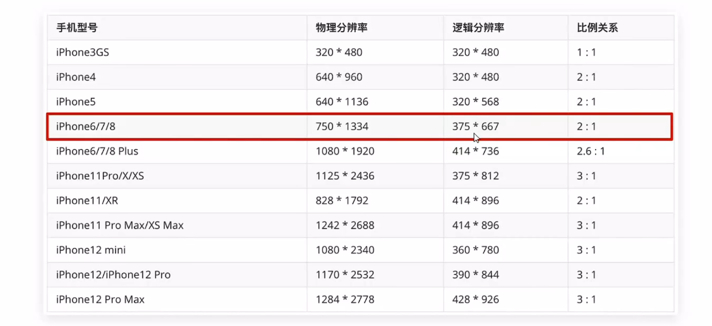

#  Day13-d3-移动web-移动适配方案

## 1. 分辨率，视口，二倍图
1. 屏幕分辨率
   - 屏幕分辨率：纵横向的像素点数，单位是px
   - PC分辨率
     - 1920*1080
     - 1365*768
     - .....

   - 缩放150%
     - 1920 /150%
     - 1080 / 150%
    
    - 总结
      - 硬件分辨率      -> 物理分辨率(出厂数值)
      - 缩放调节的分辨率 -> 逻辑分辨率(软件/驱动设置)

   - 屏幕分辨率
   

2. 视口
   - 手机屏幕尺寸不同，网页宽度均为100%
   - 网页的宽度和逻辑分辨率尺寸相同
   - 视口：显示HTML网页的区域，用来约束HTML尺寸
   - width=device-width:视口宽度 = 设备宽度
   - inital-scale=1.0:  缩放1倍(不缩放)

3. 二倍图
   - 现阶段设计稿参考iPhone6/7/8,设备宽度375px产出设计稿
   - 二倍图设计稿尺寸：750px

4. 适配方案
   - 宽度适配: 宽度自适应
     - 百分比布局
     - Flex布局

   - 等比例:   宽高等比缩放
     - rem
     - vm
## 2. rem 
5. 概念
   - rem单位，是相对单位
   - ren单位是相对于HTML标签的字号计算结果
   - 1rem = 1HTML字号大小

6. 媒体查询
   - 手机大小不同，分辨率不同，如何设置不同的HTML标签字号呢
     - 媒体查询
   - 媒体查询能够检测视口的宽度，然后编写差异化的css样式
   - 当某个条件成立时，执行对应的css样式
     ```
      @media (媒体特征) {
         选择器 {
            CSS 属性
         }
      }
     ```

7. 设备宽度不同，HTML标签字号设置多少合适
   - 设备宽度大 元素尺寸大
   - 设备宽度小 元素尺寸小
   - 目前rem不不方案中 将网页等分成10份HTML标签字号为视口宽度的1/10

8. rem-flexble.js
   - flexble.js是淘宝开发的一个用来适配移动端的js库
   - 核心原理就是根据不同的视口宽度给网页中的html根节点设置不同的font-size

9. rem-移动适配
   - rem单位尺寸
     - 确定基准根字号
       - 查看设计稿宽度 -> 确定参考设备宽度(视口宽度) -> 确定基准根字号(1/10)
    
     - rem单位尺寸
       - rem单位尺寸 = px单位数值 / 基准根字号

# 3. less
10. less - 简介
    - less是一个css预处理器less文件后缀名是.less。扩充了css语言，使css具备了一定的逻辑性，计算能力
    - 注意浏览器不识别less代码，目前阶段，网页要引入对应的css文件
    - vs code插件：Easy LESS，保存less文件后自动生成对应的css文件

11. less注释
    - 单行注释
      - 语法：// 注释内容
      - 快捷键：ctrl + /

    - 块注释(多行注释)
      - 语法：/* 注释内容 */
      - 快捷键：Shift + Alt + A

    - 注意 
      - css不支持单行注释

 


      
       

