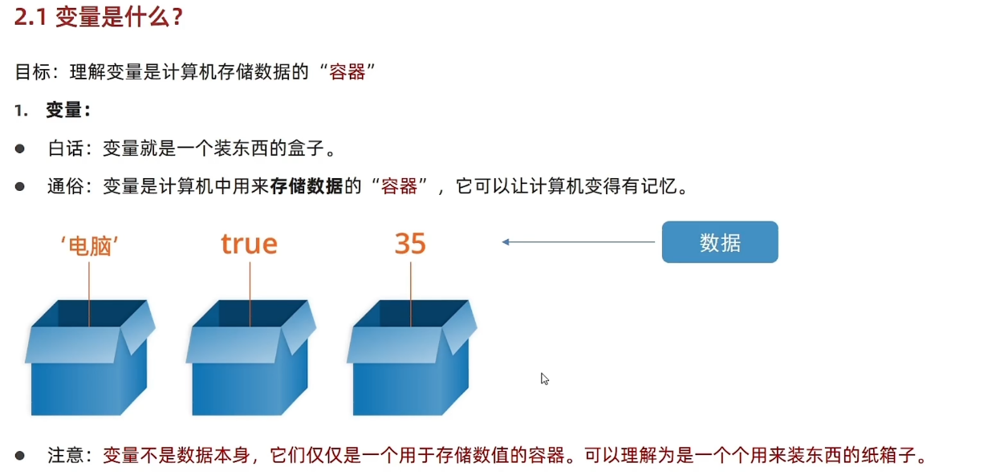

# Day01-d1基础语法

## 1. javascript介绍
1. javascript是什么
   - 是一个运行在客户端(浏览器)的编程语言，实现人机交互效果。
   
   

2. 作用(做什么)
   - 网页特效(监听用户的一些行为让网页做出对应的反馈)
   
   - 表单验证(针对表单数据的合法性进行判断)
   
   - 数据交互(获取后台数据，渲染前端)

   - 服务的编程(node.js)
   
    
   
3. javascript的组成(有什么)
   - ECMAScript
     - 规定了基础语法
       - 比如：变量，分支语句，循环语句，对象等
   
    - Web APIs
      - DOM: 操作文档，比如页面元素进行移动，大小，添加，删除等
      - BOM：操作浏览器，比如页面弹窗，检测窗口宽度，存储数据到浏览器等

4. 总结
   - javascript是什么
     - javascript是一种运行在客户端(浏览器)的编程语言
   
     - javascript组成是什么
       - ECMAScript(基础语法)，webAPIs(DOM,BOM)

5. js书写位置
   - 内部js
        在直接写在html文件里，用script标签包住
        规范：script标签写在</body>上面
        拓展：alert('内容')页面弹出警告对话框

         - 注意事项
           如果将<script>放在html文件的底部附近的原因是浏览器会按照代码中的顺序加载html
           如果先加载的js期望修改其下方的html，那么他可能由于html还没加载尔失效
           因此，将js代码放在html页面底部附近通常是最好的 

           ```javascript
            <script>
                alert('内容')
            </script>
            </body>
           ```

   - 外部js
        代码放在以js为结尾的文件里
        语法：通过script标签引到html页面中
        
           - 注意事项
             script标签中间无需写代码，否则会被忽略
             外部介绍会使代码更加有序，易于复用，且没有脚本的混合，html也更加易
             读，这是个好习惯

             ```javascript
               <body>
                <!-- 通过scr引入外部的js文件 -->
                <script>scr="my.js"</script>
               </body>     
        
        ~~~javascript
        ```
        ~~~
        
    - 内联系js 
        代码写在标签内部
             语法：
             注意：了解即可，vue框架会用到这种
   
        ```javascript
        <body>
        <button> onclick="alert"("内容")>内容</button>
        </body>
        ```
   
6. 总结
   - js书写的三种位置
     内部
     外部
     行内

     - 注意事项
       书写位置尽量写到文档末尾</body>前面
       外部js标签不要写代码，否则会被忽略

7. JavaScript注释
   - 单行注释
     - 符号：//
     - 作用：//右边这一行的代码会被忽略
     - 快捷键：ctrl + /

   - 块注释
     - 符号：/ ** /
     - 作用：在/ *和 */之间所有内容都被忽略
     - 快捷键：ctrl + shirt + /

8. 结束符
   - 作用：使用英文的分号; 代表语句的结束
   - 实际情况：实际开发中，可以不写，浏览器(JavaScript引擎)可以自动推断语句结束的位置
   - 现状：在实际开发中，越来越多的人主张，书写JavaScript代码省略结束符
   - 约定：为了风格统一，结束符要么每句都写，要么每句都不写

9. 总结
   - JavaScript注释有哪两种
     - 单行注释 //
     - 多行注注释 /**/


10. JavaScript结束符注意点
   - 结束符是 英文的分号 ;
   - 结束符可以省略吗
     - 可以
     - 但为了风格统一，结束符要么每句都写，要么每句都不写

11. JavaScript输入输出语句
    - 什么是语法
      - 人和计算机打交到的规则约定
      - 按照规则书写

    - 输入和输出语法
      - 输入和输出也也可以理解为人和计算机交互，用户通过键盘，
        鼠标等向计算机输入信息，计算机处理后在展示给用户
        这便是一次输入和输出的过程
      - 输入语法
        - 语法
        - 作用：显示对话框，对话框中包括一条文字信息，用于提示用户输入文字
          ```javascript
           prompt('内容')
          ```
      - 输出语法
        - 语法1
        - 作用：向body内输出内容
        - 注意：如果输出内容写到的标签也会被解析成网页元素 
          ```javascript
           document.wirte('内容')
          ```

        - 语法2
        - 作用：页面弹出警告对话框
          ```javascript
            alert('要输出的内容')
          ```

        - 语法3
        - 作用：控制台输出语法，程序调试使用
        ```javascript
        console.log('控制台打印')
        ```

    - 代码执行顺序
      - 按HTML文档流顺序执行js代码
      - alert()和prompt()它们会跳过页面渲染先被执行

12. 字变量
    - 在计算机科学中，字变量(literal)是在计算机中描述事/物
    
13. 总结
    - JavaScript是什么
      - JavaScript是一门编程语言，可以实现网页交互效果
    
    - JavaScript抒写位置
      - 行内JavaScript
      - 内部JavaScript - 写到</nody>的上方
      - 外部JavaScript - 但是<script>标签不要写内容，否则会被忽略

    - JavaScropt注释
      - 单行注释 //
      - 多行注释 /**/

    - JavaScript结束符
      - 分号; 可以写也可以不写，按照团队约定

    - JavaScript输入和输出语句
      - 输入：prompt()
      - 输出：alert()  document.write() console.log()

## 2. 变量
14. 变量是什么
    - 理解变量是个容器
      - 变量
        - 白话：变量就是一个装东西的盒子
        - 通俗：变量是计算机中用来存储数据的 “容器”，它可以让计算机变得有记忆
        - 注意：变量不是数据的的本身，它们仅仅用于存储数值的容器。可以理解为是
          一个个用来装东西的箱子
          

      - 总结
        - 变量怎么理解
          - 计算机中用来存储数据的“容器”，简单理解是一个个的盒子
          - 变量的作用
            - 用来存放数据的，注意变量指定的容器而不是数据
      
      - 变量声明和赋值
        - 变量的声明
          - 要想使用变量，必须需要创建变量(也称声明变量或是定义变量)
          - 声明变量有两部分构成：声明关键字,变量名(标识)
          - let即关键字(let：允许 许可 让 要)，所谓关键字是系统提供专门用来声明
            (定义)变量名的词语
          
          - 语法
            ```javascript
              let 变量名
            ```
          - 举例
            ```javascript
              let age
            ```
          - 声明了一个age变量
          - age即变量名称，即标识符

        - 变量的赋值
          - 定义了变量后，可以初始化变量(赋值)，在变量名后面跟一个 "="然后是数值
          - 注意：通过变量名获得变量里的数据

        - 更新变量
          - 变量赋值后，还可以通过简单地给它一个不同的值来更新

        - 声明多个变量
          - 说明：并不推荐
          - 语法
            ```javascript
              let age = 18 , uname = "zhangsan"
            ```

        - 总结
          - 变量赋值之后如何更新变量
            - 直接给一个不同的值就行
            - 提倡一行同时声明多个不同的变量吗
            - 不提倡 可读性不好

        - 变量的本质
          - 内存：计算机存储数据的地方，相当于一个空间
          - 变量的本质：是程序在内存中申请的一块用来存放数据的小空间

        - 变量的命令规则与规范
          - 规则：必须遵守，不遵守报错(法律层面)
          - 规范：建议，不遵守不会报错，但不符合业内同识(道德层面)、
          - 规则
            - 不能用关键字
              - 关键字：有特殊含义的字符，JavaScript内置的一些英语词汇，例如：let var if for
            - 只能用下划线 字母 数字 $组成
            - 字母严格区分大小写 
          - 规范
            - 见名知意
            - 遵守小驼峰命名法
              - 第一个单词首字母小写，后面每一个单词首字母大写

          - 拓展 let与val区别
            - 在较旧的JavaScript，使用val来声明关键字而不是let
            - var在开发中一般不会使用
            - let为了解决vae一些问题
            - var声明
              - 可以先使用 在声明(不合理)
              - var声明过的变量可以重复声明(不合理)
              - 比如变量提升，全局变量，没有块级作用域等待
            - 结论  
              - var就是个bug，

        
