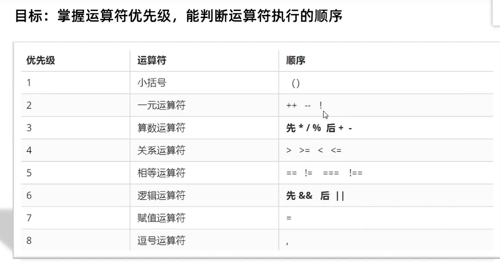

## Day02-d2基础语法

## 1.运算符
1. 赋值运算符
   - 赋值运算符：对变量进行赋值的运算符
   - 比如：= 将等号的右边的值赋予给左边，要求左边必须是个容器
   - 其他运算符
     - += -= *= /= %=
   - 总结
     - = 赋值运算符执行过程
       - 将等号的右边赋予给左边，要求左边必须是个容器
     - += 出现是为了简化代码，比如让let num = 10，num+5怎么写
        - num += 5
   
2. 一元运算符
   - 目标：能用一元运算符做自增运算
   - 在js中运算符可以根据所需表达式的个数，分为一元运算符，二元运算符，三元运算符
   - 一元运算符
     eg：
     正负号
   - 二元运算符
     eg：
     ```javascript
      let num = 10 + 20
     ```
   - 自增
     - 符号：++
     - 作用：让变量+1
   - 自减
     - 符号--
     - 让变量-1
   - 使用场景
     - 经常用于计数使用 比如进行10次操作用它计算进行多少次了
   - 自增运算符的用法
     
     - 前置运算符
       - 每执行1次，当前变量的值加1
       - 其作用相当于num += 1
       ```
        let num = 1 
        ++n //让num值加1变2
       ```
     - 后置运算符
       - 每执行1次，当前变量数值加1
       - 其作用相当于num += 1
       ```
        let num = 1
        num ++ //让num值1边2
       ```
       
     - 前置自增
       - 前置自增：先自加后使用(记忆：++在前 先加)
       ```javascript
        let i = 1
        console.log(++i +2) //结果是4
        // 注意：i是2
        // i先自加1 变成2之后 在和后面的2相加
       ```
     - 后置自增
       - 后置自增：先使用在自加(记忆：++在后 后加)
       ```javascript
         let i = 1 
         console.log(i++ +2) //结果是3
         // 注意：此时i是1
         // 先和2相加，先运算输出完毕之后，i在自加是2
       ```
     - 总结
       - 只需要用一个表达式就可以用的运算符叫一元运算符
       - 自增运算符也是简化写法，每次自加1 使用场景是什么
         - 经常用于计数来使用，用来计算多少次
       - 实际开发中，一般都是单独使用 后置++更多 
   
3. 比较运算符
   - 目标：使用常见的比较运算符进行比较运算
   - 比较运算符的介绍
     - 使用场景：比较两个数据大小，是否相等
   - 比较运算符的使用
     - 
     - 比较运算符
       - ```javascript
          >    左边是否大于右边
          <    左边是否小于右边
          >=   左边是否大于或等于右边
          <=   左边是否小于或等于右边
          ==   左右两边的值是否相等
          ===  左右两边是否类型和值相等
          !==  左右两边是否不全等
          比较结果为boolean类型，即true和false
       ```
     - 对比
       ```javascript
            =    单等是赋值
            ==   是判断
            ===  是全等
            开发中判断是否相等，推荐使用全等
       ```
   - 比较运算符的细节
     - 字符串比较，是比较字符对应的ASCII码
       - 从左往右依次比较
       - 如果第一位一样在比较第二位，以此类推
       - 了解即可
     - NaN不等于任何值，包括本生
       - 涉及到"NaN"都是false
     - 尽量不要比较小数，小数有精度问题
     - 不同类型之间的比较会发生隐式转换
        - 最终把数据隐式转换成number类型在比较
        - 在开发中，如果进行准确的比较推荐使用===或!==
   - 总结
     - = ,==和===怎么区别
       - =      是赋值
       - ==     是判断只要求值相等，不要求数据类型一样即可返回false
       - ==     是全等，要求值和数据类型都一样返回才是true
       - 开发中  推荐使用===
     - 比较运算符返回结果是什么
       - true false 

4. 逻辑运算符
   - 目标：掌握逻辑运算符，为程序能思考做准备
   - 逻辑运算符的介绍
     - 使用场景：逻辑运算解决多重条件判断
   - 逻辑运算符的使用
     - 
     
     |   符号   |  名称    |    日常读法  | 特点     |   口诀   |
     | ---- | ---- | ---- | ---- | ---- |
     |   && | 逻辑与 | 并且 | 符号两边都为true结果才为true | 一假则假 |
     | \|\| | 逻辑或 | 或者 | 符号两边有一个true就为true | 一真则真 |
     | ！ | 逻辑非 | 取反 | true变false，false变true | 真变假，假变真 |
   - 总结
     - 逻辑运算符有那三个
       - 与(&&)
       - 或(||)
       - 非(!)
   
5. 运算符的优先级
   - 目标：掌握运算符优先级，能判断运算符的执行顺序
   
   - 
     | 优先级 | 运算符     | 顺序           |
     | ------ | ---------- | -------------- |
     | 1      | 小括号     | ()             |
     | 2      | 一元运算符 | ++ -- !        |
     | 3      | 算术运算符 | 先 * / % 后+ - |
     | 4      | 关系运算符 | > >= < <=      |
     | 5      | 相等运算符 | == != === !==  |
     | 6      | 逻辑运算符 | 先 && 后 \|\|  |
     | 7      | 赋值运算符 | =              |
     | 8      | 逗号运算符 | ，             |
     
## 2.语句