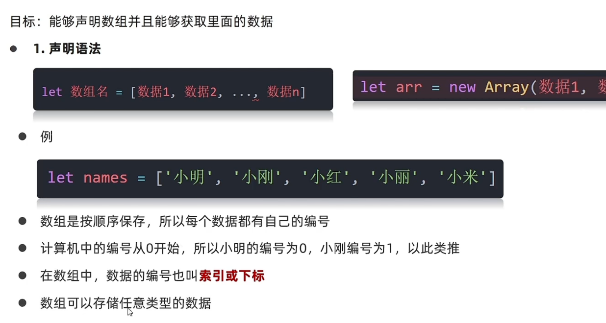
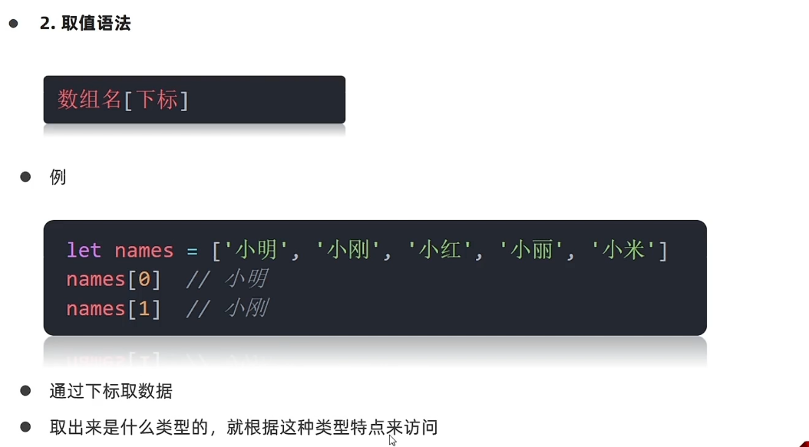
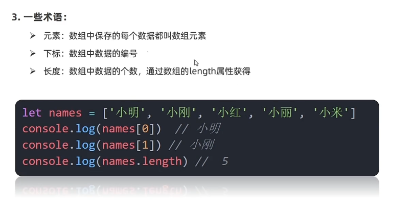
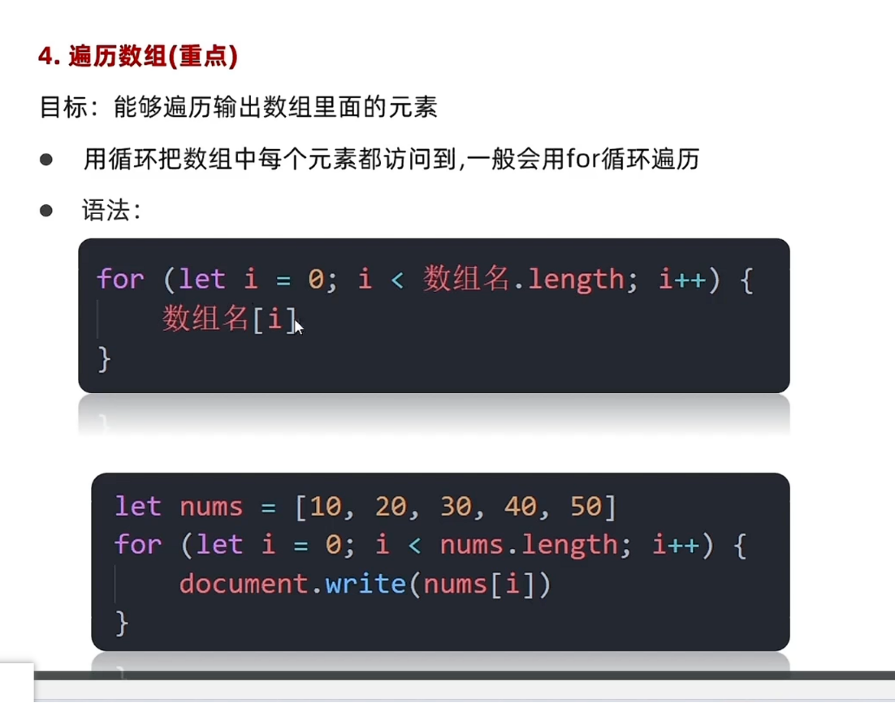

# Day03-d3-基础语法-循环for-数值

## 循环-for
1. for循环基本使用
   - for循环的语法
     - 作用：重复执行代码
     - 把声明的起始值，循环条件，变化值写到一起，更加清楚
       ```javascript
        for (变量起始值；终止条件，变量的变化量) {
            循环体；
        }
       ```

     - 退出循环
       - continie:退出本次循环，一般用于排除或者跳过某一个选项的时候，可以使用continue
       - break:   退出整个for循环，一般用于结果已经得到，后续的循环不需要的时候可以使用
     - 了解：
       - while(true)来构造“无限”循环，需要使用break退出循环
       - for(;;)也可以构造“无限”循环，同样使用break退出循环
     - 总结
       - for循环和while循环有声明区别
         - 如果明确了循环的次数的时候推荐使用for循环
         - 当不明确循环次数的时候推荐使用while循环

2. 循环嵌套
   - 一个循环里在套一个循环
   - 语法：
   ```javascript
      for (外部声明记录循环次数的变量; 循环条件; 变化值) {

          for (内部声明记录循环次数的变量; 循环条件; 变量值) {
            循环体
          }
      }
   ``` 


## 数值
3. 数组是什么
   - 目标：能够说明数组是什么
   - 数组：(Array)是一种可以按顺序保存数据的数据类型
   - 为什么要有数组
     - 场景:如果有多个数据可以用数组保存起来，然后放到一个变量中，管理方便
4. 数组的基本使用
   - 目标：能够声明数组并且能够获取里面的数据
     - 
     - 数值是按顺序保存，所以每个数据都有自己的编号
     - 计算机编号是0开始，
     - 在数组中，数据的编号也叫索引或下标
     - 数组可以存储任意类型的数据
     - 声明用法
       - 语法一：
       ```javascript
           let 数组名 = [数据1， 数据2， 数据3， ..., 数据n] 
        ```

       - 语法：
       ```javascript
          let arr = [xxx1, xxx2, xxx3, ..., XXXn]
       ```


   - 赋值语法
     - 
     - 通过下标获取数据
     - 取出来是什么类型的，就根据这种类型特点来访问
     - 取值语法
      ```javascript
        数组名[下标]
      ```

     - 例
       ```javascript
        let name =  ['小名', '小往', '小张', '小丽']
        name[0]
        name[1]
       ```
   - 一些术语
     - 
     - 元素：数组中保存的每个数据都叫数组元素
     - 下标：数组中数据的编号
     - 长度：数组中数据的个数通过数组的length属性获取

   - 遍历数组(重点)
     - 
     - 目标：能够遍历输出数组例的元素
     - 用是把数组里的元素都访问到，一般会用到for循环遍历
       - 语法
         ```javascript
          for (let i = 0; i < 数组名.lengts; i++) {
            数组名[i]
          }
         ```

       - 例
         ```javascript
            let number = [10, 20, 30, 40]
            for (let i = 0; i < number.length; i++) {
              document.write(number[0])
            }
         ```


5. 操作数组