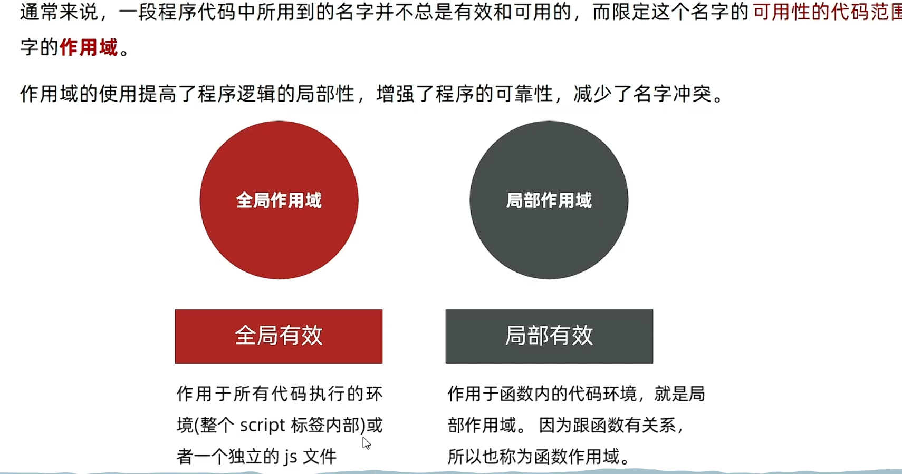
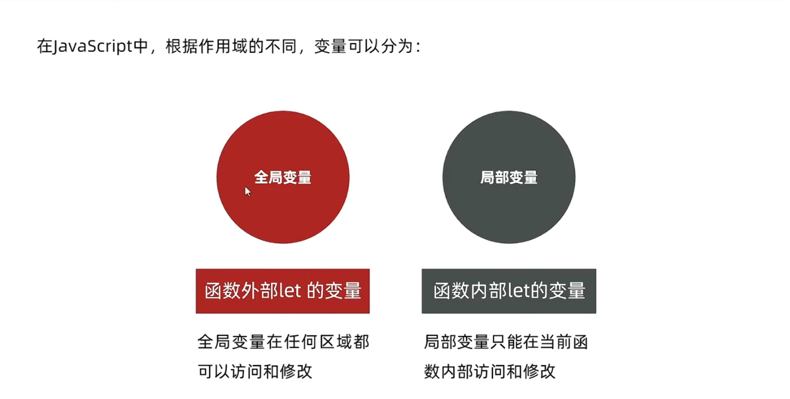
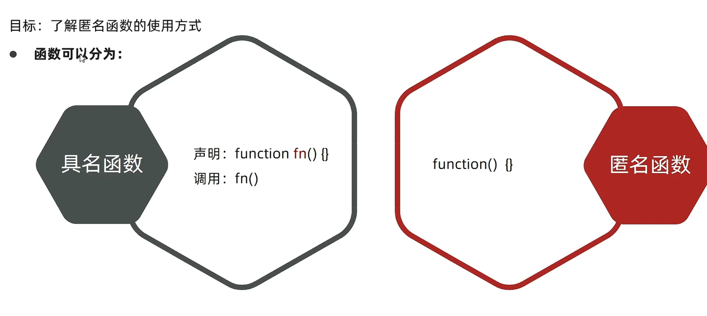
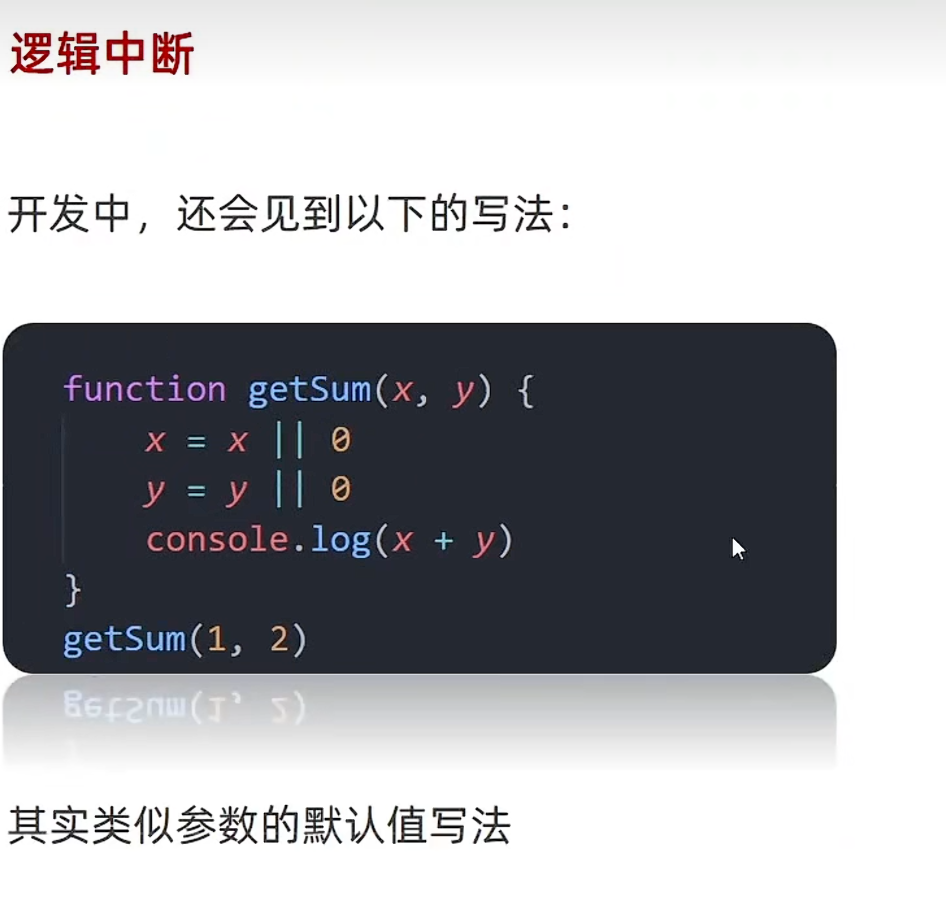
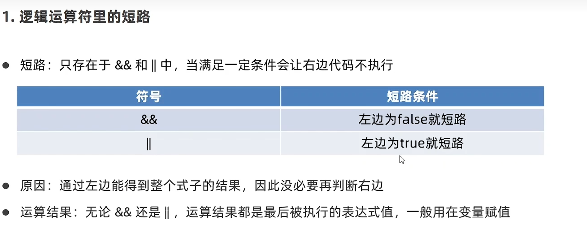
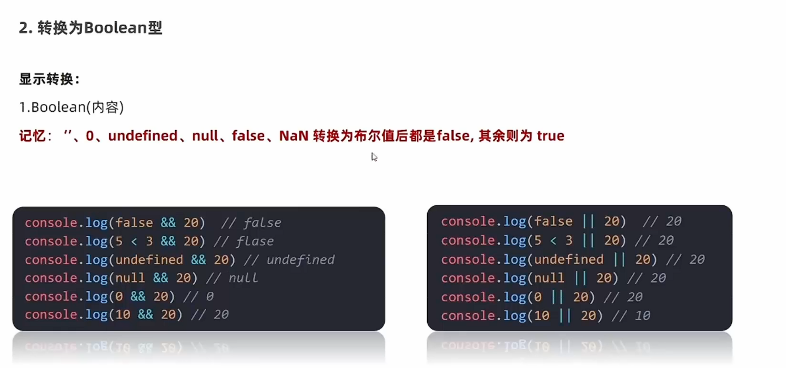
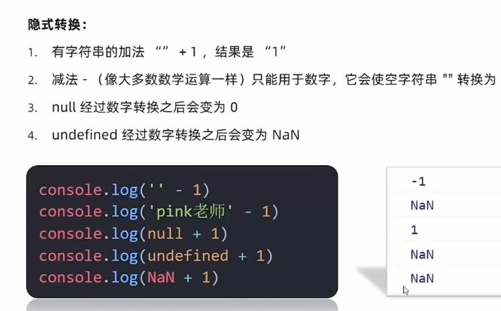

# Day04-d4-基础-函数

## 函数
1. 为什么需要函数
   - 目标：能说出为什么需要函数
   - 函数
     function，是被设计为执行特定任务的代码块
   - 说明：
     函数可以把具有相同或相似逻辑代码”包裹“起来，通过函数调用执行这些被”包裹“的代码逻辑，
     优势是精简代码方便复用
     比如alert(),prompt(),console()，是js已经封装好的函数，直接调用即可

   - 总结
     - 为什么需要函数
       - 可以实现代码复用，提高开发效率
     - 函数是说明
       function执行特定任务的代码

2. 函数使用
   - 目标：掌握函数语法，把代码封装起来
   - 函数的声语法
     ```javascript
        function 函数名() {
            函数体
        }
     ```
     - 例
       ```javascript
        function sayHi() {
            document.write('hai~~')
        }
       ```
   - 函数的命名规范
     - 和变量名基本一致
     - 尽量用小驼峰命名法
     - 前缀因该为动词
     - 命名建议：常用动词约定
       ```javascript
        function getName() {}
        function addSquares() {}
       ```
       
       |   动词  |  含义     |
       | ---- | ---- |
       |    can  |  判断是否可执行某个动作    |
       |  has    |   判断是否含义某个值   |
       |   is   |   判断是否为某个值   |
       |   get   |  获取某个值    |
       |     set |  设置某个值    |
       |     load |  加载某些数据    |

   - 函数调用语法
     - **注意**
       
       - 声明(定义)的函数必须调用才会被执行，使用()调用函数
     - 格式
       ```javascript
        //函数调，这些函数体内的代码逻辑会被执行
        函数名()
       ```
     - 例
       ```javascript
        //函数一次声明可以多次调用，每一次函数调用函数体里面的代码会重新执行一遍
        sayHi()
        sayHi()
       ```
     
   - 函数体
     - 函数体是函数的构成部分，它负责将相同或相似的代码包裹起来，直到函数调用时函数体的代码才会被
       执行，功能代码都要写在函数体当中
   
   - 总结
     - 函数使用那个关键字声明的
       - function
     - 函数不调用会执行吗，如何调用函数
       - 函数不调用自己不执行
       - 调用方式：函数名()
     - 函数的复用代码和循环代码有什么不同
       - 循环代码写完即执行，不能很方便控制执行位置
       - 随时调用，随时执行，可重复调用
       
   
3. 函数传参
   - 声明方法
     - 语法
     ```javascript
        function 函数名(参数列表) {
          方法体；
        }
     ```
   - 调用语法
     - 注意
       - 嗲用函数时，需要传入几个数据就写几个，用逗号隔开
     - 语法
       ```javascript
          函数名(传参的参数列表)
       ```

       - 列
         ```javascrit
            getSum(10,20)
         ```
   - 注意
     - 
     - 形参：声明函数时写在函数名右边小括号里面叫形参(形式上的参数)
     - 实参：调用函数时写在函数名右边小括号例面叫实参(实际上的参数)
     - 形参可以理解为是在这个函数内声明的变量实参可以理解为给这个变量赋
     - 开发中尽量保存形参和实参一致
     - 参数默认值
       

   - 总结
     - 函数的传递参数的好处
       - 可以极大提高了函数的灵活性
     - 函数参数可以分为那两类，怎么判断
       - 函数可以分为形参和实参
       - 函数声明时，小括号里面是形参，形式上的承参数
       - 函数调用时，小括号里面是实参，实际的参数
       - 尽量保持形参和实参个数一致
     - 参数中间用什么符号隔开
       - 逗号

4. 函数返回值
   - 语法
     .png)
     .png)

   - 函数细节补充
     - 两个相同函数后面的覆盖前面的函数
     - 在js中实参的个数和形参的个数可以不一致
       - 如果形参过多，会自动填上undefined(了解)
       - 如果实参过多，那么多余的实参会被忽略(函数内部有一个arguments,里面装的所有实参)
     - 函数一旦碰到return就不会往下执行了，函数的结束用return
   
   
   - 总结
     - 为什么函数要有返回值
       - 函数执行后得到结果,结果是调用者拿到的(函数内部不需要输出结果,而是返回结果)
       - 对执行结果的拓展性更高,可以让其他程序使用结果
     - 函数的返回值有什么函数,注意事项
       - 语法 return 数据
       - return后面不接数据或者函数内不写return,函数的返回值是undefined
       - return内立即结束当前函数,所以return后面数据不要换行
   
5. 作用域
   
   
   - 通常来说，一段程序所用到的名字并不是总是有效和可用的，而限定这个名字的可用性代码范围
     就是这个名字的作用域
   - 作用域提高的程序逻辑的局限性，增强程序的可靠性，减少了名字冲突。
   - 全局作用域:全局有效
     作用于所有代码执行的环境(整个script标签内部)或者有个独立的js文件
   - 局部作用域:局部有效
     - 作用于函数内的代码环境，就是局部作用域，因为跟函数有关，也称函数作用域


   - 在js中根据作用域不同，变量可分为
     - 全局变量：函数外部了let的变量
       - 全局变量在如何区域都可以访问和修改
     - 局部变量:函数内部let的变量
       - 局部变量只能在当前函数内部访问和修改

   - 变量的访问原则
     - 只要是代码，就至少有有个作用域
     - 写在函数内部的局部作用域
     - 如果函数中还有函数，那么在这个作用域中就又可以诞生有个作用域
     - 访问原则:在能够访问到的情况下，先局部在全局，就近原则

   - 总结
     - js的作用域分为那两种
       - 全局作用域：函数外部或者整个script
       - 局部作用域: 也称为函数作用域，函数内部有效
     - 根据作用域不同，变量分为那两种
       - 全局变量
       - 局部变量
     - 有一种特殊情况是全局变量的那两种
       - 局部变量或者是块级变量，没有let声明直接赋值当全局变量看
       - 不提倡


6. 匿名函数
   - 目标:了解匿名函数的所用方式
   - 
   - 函数可以分为
     - 具名函数
        ```javascript
          声明 function fu () {}
        ```
     - 匿名函数
       ```javascript
          function () {}
       ```

     - 没有名字的函数，无法直接使用
     - 使用方式
       - 函数表达式
         - 将匿名函数赋值给一个变量，并且通过变量名称进行调用，我们将这个函数称为函数表达式
         - 语法
           ```javascript
            let fn = function () {
              函数体
            }
           ```
         
       - 立即执行函数
         - 场景介绍:避免全局变量中间污染
         - 注意
           - 多个立即执行函数需要用;隔开，要不然会报错
         - 语法
           ```javascript
              (function () {})();
           ```

     - 总结
       - 立即执行函数有什么作用
         - 防止变量污染
       - 立即执行函数需要调用吗，有什么注意事项
         - 无需调用立即执行，其实本质已经调用了
         - 多个立即执行函数之间用;隔开

7. 逻辑中断
   - 
   - 
   
   - 逻辑运算符中的短路
     - 短路:只存在于$$和||中,当满足一定条件会让右边条件不执行
       | 符号     |    短路  |
       | ---- | ---- |
       |  &&  |    左边为false就短路  |
       |  ||    |  左边为true就短路    |

8. 转换为Boolean型
   - 显示转换
     
   - 隐显转换
     
       