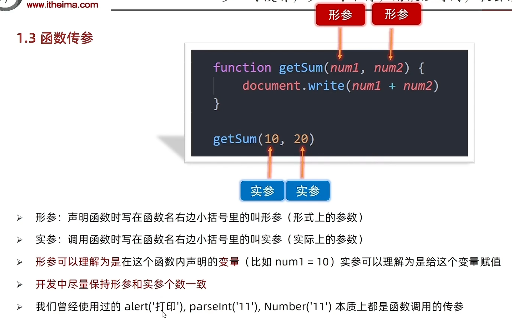
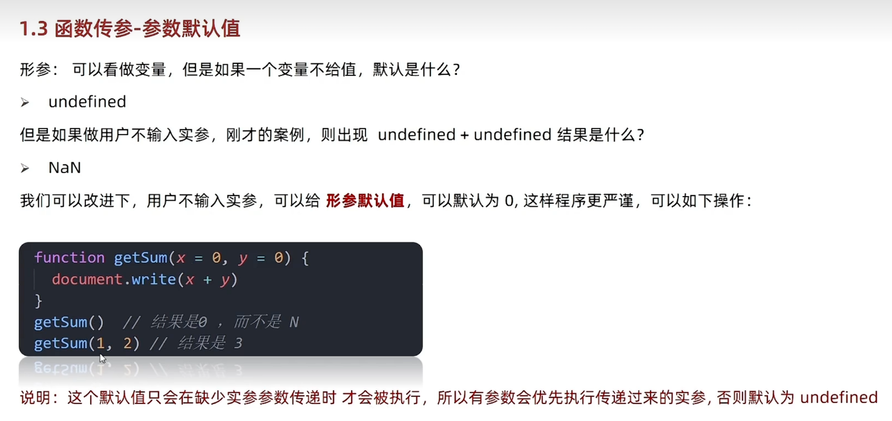

# Day04-d4-基础-函数

## 函数
1. 为什么需要函数
   - 目标：能说出为什么需要函数
   - 函数
     function，是被设计为执行特定任务的代码块
   - 说明：
     函数可以把具有相同或相似逻辑代码”包裹“起来，通过函数调用执行这些被”包裹“的代码逻辑，
     优势是精简代码方便复用
     比如alert(),prompt(),console()，是js已经封装好的函数，直接调用即可

   - 总结
     - 为什么需要函数
       - 可以实现代码复用，提高开发效率
     - 函数是说明
       function执行特定任务的代码

2. 函数使用
   - 目标：掌握函数语法，把代码封装起来
   - 函数的声语法
     ```javascript
        function 函数名() {
            函数体
        }
     ```
     - 例
       ```javascript
        function sayHi() {
            document.write('hai~~')
        }
       ```
   - 函数的命名规范
     - 和变量名基本一致
     - 尽量用小驼峰命名法
     - 前缀因该为动词
     - 命名建议：常用动词约定
       ```javascript
        function getName() {}
        function addSquares() {}
       ```
       
       |   动词  |  含义     |
       | ---- | ---- |
       |    can  |  判断是否可执行某个动作    |
       |  has    |   判断是否含义某个值   |
       |   is   |   判断是否为某个值   |
       |   get   |  获取某个值    |
       |     set |  设置某个值    |
       |     load |  加载某些数据    |

   - 函数调用语法
     - 注意
       - 声明(定义)的函数必须调用才会被执行，使用()调用函数
     - 格式
       ```javascript
        //函数调，这些函数体内的代码逻辑会被执行
        函数名()
       ```    
     - 例
       ```javascript
        //函数一次声明可以多次调用，每一次函数调用函数体里面的代码会重新执行一遍
        sayHi()
        sayHi()
       ```

   - 函数体
     - 函数体是函数的构成部分，它负责将相同或相似的代码包裹起来，直到函数调用时函数体的代码才会被
       执行，功能代码都要写在函数体当中

   - 总结
     - 函数使用那个关键字声明的
       - function
     - 函数不调用会执行吗，如何调用函数
       - 函数不调用自己不执行
       - 调用方式：函数名()
     - 函数的复用代码和循环代码有什么不同
       - 循环代码写完即执行，不能很方便控制执行位置
       - 随时调用，随时执行，可重复调用
       
        
3. 函数传参
   - 声明方法
     - 语法
     ```javascript
        function 函数名(参数列表) {
          方法体；
        }
     ```
   - 调用语法
     - 注意
       - 嗲用函数时，需要传入几个数据就写几个，用逗号隔开
     - 语法
       ```javascript
          函数名(传参的参数列表)
       ```

       - 列
         ```javascrit
            getSum(10,20)
         ```
   - 注意
     - 
     - 形参：声明函数时写在函数名右边小括号里面叫形参(形式上的参数)
     - 实参：调用函数时写在函数名右边小括号例面叫实参(实际上的参数)
     - 形参可以理解为是在这个函数内声明的变量实参可以理解为给这个变量赋
     - 开发中尽量保存形参和实参一致
     - 参数默认值
       

   - 总结
     - 函数的传递参数的好处
       - 可以极大提高了函数的灵活性
     - 函数参数可以分为那两类，怎么判断
       - 函数可以分为形参和实参
       - 函数声明时，小括号里面是形参，形式上的承参数
       - 函数调用时，小括号里面是实参，实际的参数
       - 尽量保持形参和实参个数一致
     - 参数中间用什么符号隔开
       - 逗号

4. 函数返回值

5. 作用域

6. 匿名函数