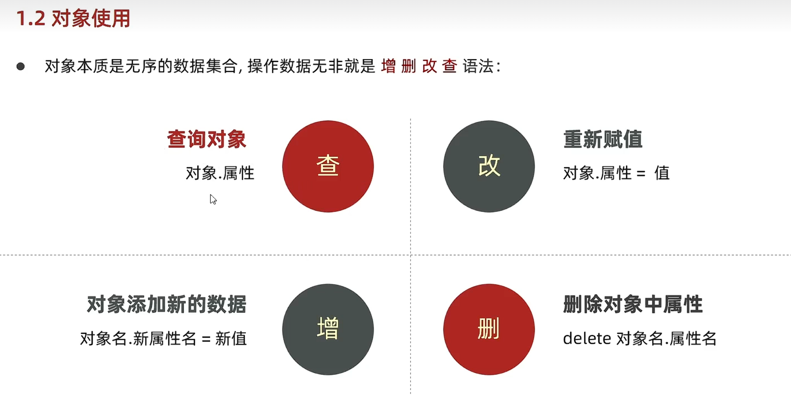
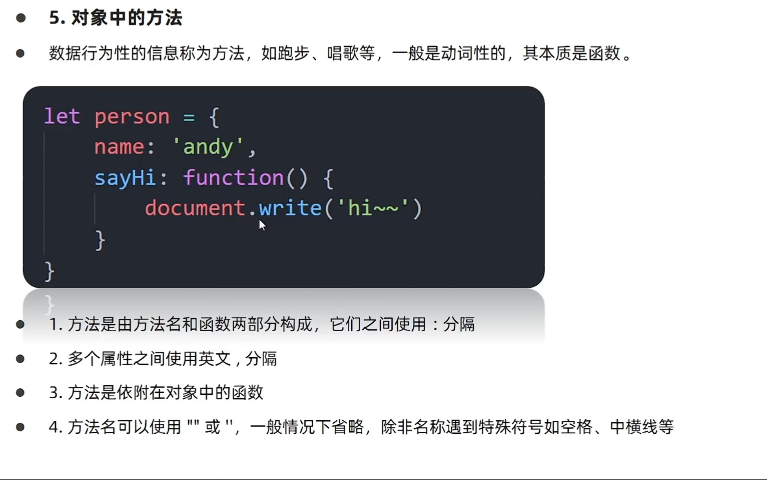
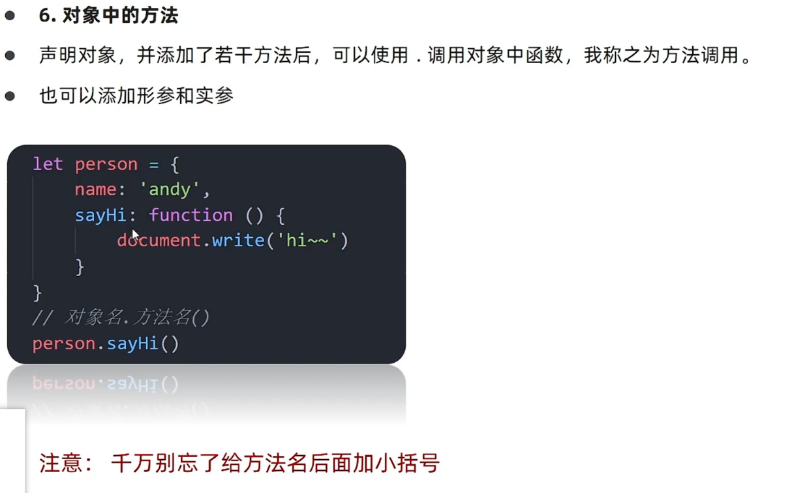
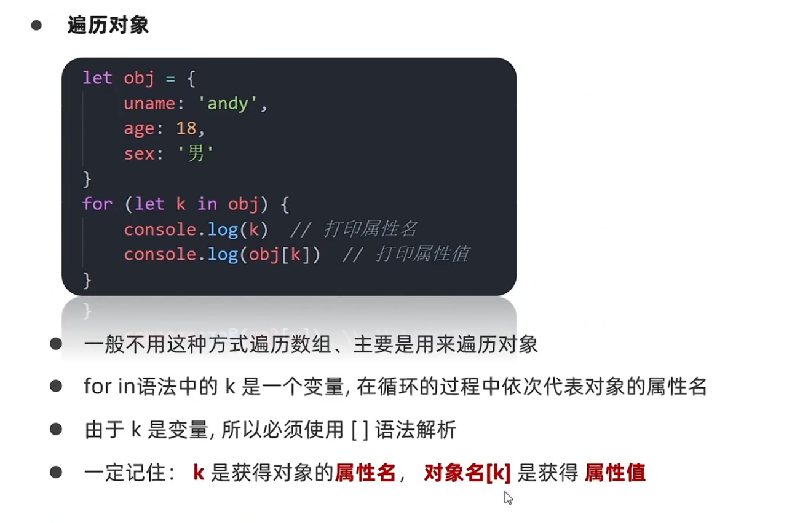

# Day05-d5-基础-对象

## 对象
1. 什么是对象
   - 对象(Object)：js的一种数据类型
   - 用来描述一个事务

   - 总结
     - 对象是什么
       - 对象是一种数据类型
       - 无序的数据的集合
     - 对象有什么特点
       - 无序的数据集合
       - 可以详细描写某个事物

2. 对象使用
   - 掌握对象语法用它保存多个数据
   - 声明语法
     ```javascript
        let 的姓名 = {}
     ```
   - 例如
     ```javascript
        let person = {}
     ```

    - 对象有属性方法组成
      - 属性:信息叫特征(名词)
      - 方法:功能叫行为(动词)
      - 例如
        ```javascript
        let 对象名 = {
            属性名：属性值
            方法名:函数
        }
      
   - 属性
     - 数据描述性的信息称属性，
     - 注意
       - 属性都是成对出现，包括属性名和值，他们之间用英文的:隔开
       - 多个属性之间用英文的,隔开
       - 属性就是依附在对象上的变量(外面是对象，里面是属性)
       - 属性名可以用""或''，
     - 例如
       ```javascript
        let object = {
            uname:"pink",
            age:18,
            gender: "男"
        }
       ```
   - 总结
     - 对象属性没有顺序
     - 属性和值用什么隔开
       - 属性和值用;隔开
       - 多个属性和值用逗号隔开

   - 操作对象CRUD
     - 目标：能够使用对象中的数据
     - 
     - 查
       - 声明对象后，并添加若干属性后可以使用(.)获取对象中属性对应的值称为访问
       - 简单理解就是获得对象里面的属性值
       - 语法：
          ```javascript
           对象名.属性名
          ```
       - 例
         ```javascript
          let obj = {
            name: "xiaomi",
            color:"pink",
          }
         
          console.log(obj.color)
         ```
       - 属性-查的另一种写法
         - 对于多次=词属性规则 - 等属性，点操作就不能用了
         - 可以采取：
           ```javascript
           对象['属性']的方式单引或双引都可以
           ```

       - 列
         ```javascript
          let obj = {
            'user-name' : "xiaomi"
            color : "pink"
          }

          console.log(obj["user-name"])
         ```

       - 总结
         - 对象访问属性有哪些
           - 点形式 对象。属性
           - []形式 对象['属性']
         - 两种方式有什么区别
           - 点后面属性名一定不要加引号
           - []里面的属性名一定加引号
           - 不同场景用不同方法
     - 增
       - 语法
         ```javascript
            对象名.新属性值 = 新值
         ```

       - 列
         ```javascript
          let obj = {
            name: "xiaomi",
            color:"pink"
          }
         
          obj.address = "中国大陆"
         ```
     - 改
       - 语法
         ```javascript
          对象名.属性名 = 新值
         ```
       - 例
         ```javascript
          let obj = {
            name: "xiaomi",
            color: "pink"
          }
          obj.color = "blue" 
          console.log(obj.color)
         ```
       
     - 删(了解)
       语法
          ```javascript
          delete.对象名。属性名
          ```
   
   - 对象中的方法
     - 
     - 数据行为信息称为方法，一般动词其本质是函数
     - 方法是有方法名和函数名两部分组成的，之间用:隔开
     - 多个属性之间用英文的，分开
     - 方法是依附在对象中的函数
     - 方法名可以使用''或"" 一般情况下省略，遇到特殊字符如空格，中横线等
     - 例
       ```javascript
          let person = {
            name : 'xiaom'
            sayHi :function() {
              document.write('hi~~~')
            }
          }
       ```

   - 对象中的方法
     - 

 
3. 遍历对象
   - 
      - 一般不用这种方法遍历数组，主要用于遍历对象
      - for in 语法中的k是一个变量，在循环的过程中依次代表对象的属性名
      - 由于k是变量，所应必须用[]语法解析
      - 记 k获得对象的属性名，对象[k]是获得属性值
      - 例
        ```javascript
        let obj = {
          uname : "kelly",
          age : 18,
          sex : 男
        } 

        for (let k in obj) {
          console.log(k)//打印属性名
          console.log(obj[k])//打印属性值
        }

        ```
   - 总结
     - 遍历对象用哪个语法
       - for in
     - 遍历对象中，for k in obj获得对象属性是那个，获得值是哪个
       - 获得对象属性是k
       - 获得对象属性值是obj[k]


4. 内置对象
   - 目标：学会调用js为我们准备好的内置对象
   - 内置对象是什么
     - js内部提供对象，方便开发者条用
   - 内置对象(Math)
     - 介绍
       - Math对象是js提供的一个数学对象
     - 作用
       - 提供一系列做数学运算的方法
     - Math对象常用的方法
       - random：生成0~1的随机数
       - celi：向下取整
       - floor：向上取整
       - max：  找最大值
       - min：  找最小值
       - pow：  幂运算
       - abs    绝对值

   - 生成任意范围的随机数