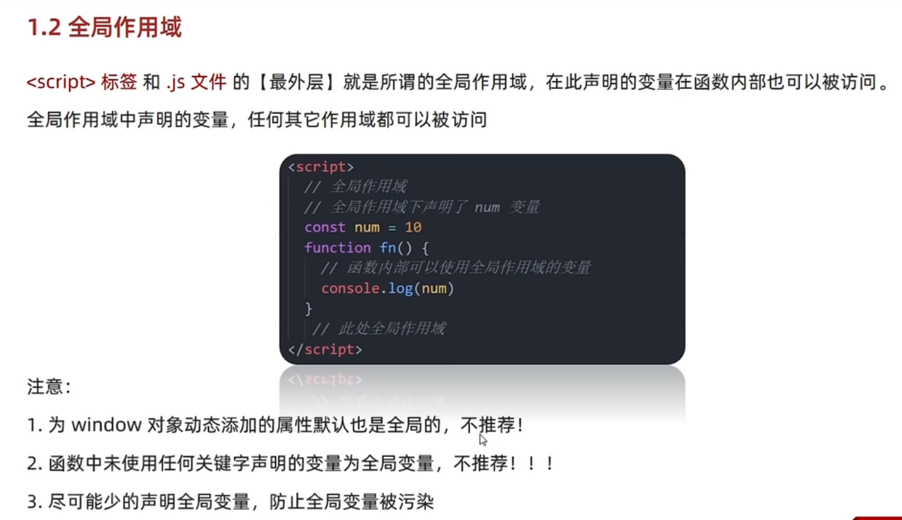
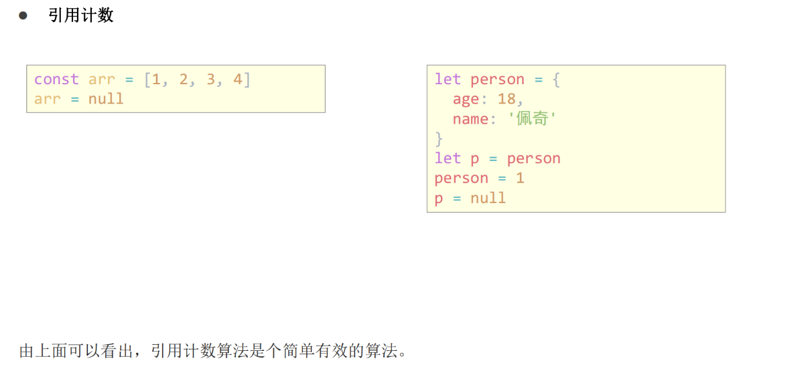
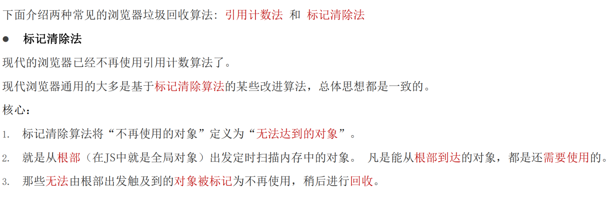
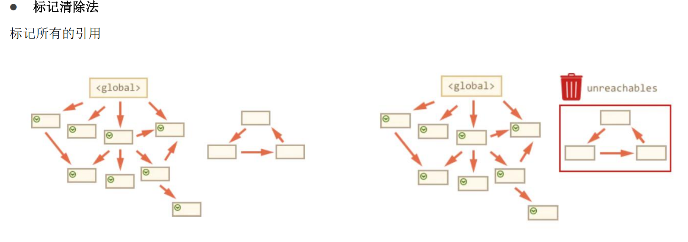
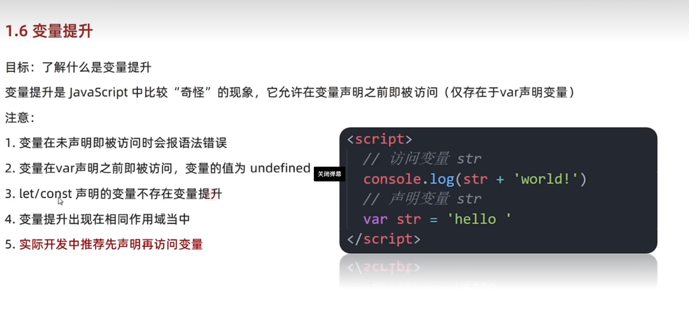
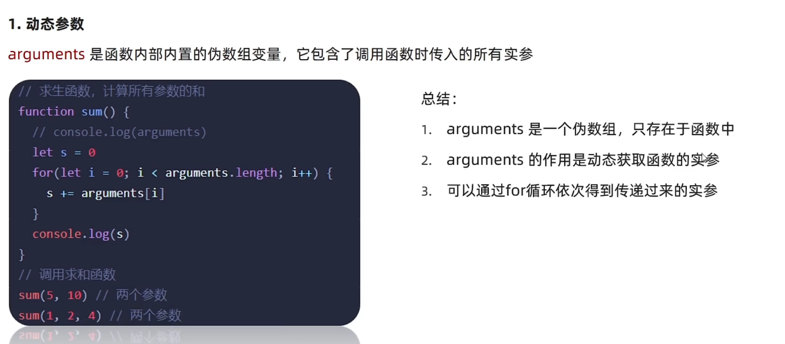

# Day01-d1-作用域-解构-箭头函数

## 一.作用域
### 1.局部作用域
  - 目标：了解作用域对程序执行的影响及作用域链的查找机制，使用闭包函数创建隔离
    作用域避免全局变量污染
  - 作用域(scope)规定了变量能够访问的范围，离开了这个范围变量就不能访问了
  - 局部作用域可以分为函数作用域和块级作用域
    - 函数作用域
      - 

      - 在函数内部声明变量只能在函数内部被访问，外部直接无法访问
        ```javascript
            <script>
              function fn() {
                //函数内部是函数作用域，属于局部变量
                const number = 0
              }
                //此处报错，函数外部不能使用局部作用域变量
              console.log(number)
            </script>
        ```
      - 总结
        - 函数能声明的变量，在函数外部无法访问
        - 函数的参数也是函数内部的局部变量
        - 不同函数内部的变量无法互相访问
        - 函数执行完毕后，函数内部的变量实际被清空了


---

- 块级作用域
- 
- 在js中使用{}包裹的代码称为代码块，代码块内部声明的变量将[有可能]无法被访问
- 代码
  ```javascript
      for(let i = 0; i <3; i++){
          //i在该代码块中被访问，正常
        console.log(i)
      }
      //超出了i的作用域，报错
      console.log(i)
  ```
- 注意
  - let，const声明的变量会产生作用域，var声明的不会产生作用域
  - 不同的代码块之间的变无法互相访问
  - 推荐使用let和const

- 总结
  - 局部作用域分为哪两种
    - 函数作用域 函数内部
    - 块级作用域 {}
  - 局部作用域声明的变量外部能使用吗
    - 不能
      
---
### 2.全局作用域
  - 
  - <script>标签和.JS文件的[最外层]就是所谓的全局作用域，在此声明的函数内部
    也可以被访问
  - 全局作用域中声明变量，任何其他作用域都可以被访问
  - 注意
    - 为window对象动态添加的属性默认也全局作用域，不推荐
    - 函数中未使用任何关键字声明的变量未全局作用域，不推荐
    - 尽可能少的声明全部作用域，防止全局变量污染
  - 总结
    - 全局作用域分为哪些
      - <script>标签内部
      - .js
    - 全局作用域声明的变量其他作用域能访问吗
      - 能

---
### 3.作用域链
- 
- 作用域链本质是底层的变量查找机制
- 在函数被执行时，会优先查找当前函数的作用域中查找变量
- 如果当前作用域链查找不到，则依次逐级查找父级作用域直到全局作用域
- 总结
  - 嵌套关系的作用域串起来形成了作用域链
  - 相同作用域链按照从小到大的规则查找变量
  - 子作用于域能访问父作用域，反之
- 总结
  - 作用域链本质是什么
    - 作用域链本质上是底层变量的查找机制
  - 作用域链查找的规则是什么
    - 会优先查找当前函数作用域中查找变量
    - 查找不到则依次逐级查找父级作用域直到全局作用域
---

### 4.GC垃圾回收机制
- 垃圾回收机制(Garbage Collection)简称GC
- JS中内存的分配和回收都是自动完成的，内存在不使用的情况下会被垃圾回收器自动回收
- 
- 内存的生命周期
  - JS环境中分配内存，一般有下生命周期
    1. 内存分配：当我们声明变量，函数，对象的时候，系统自动分配内存
    2. 内存使用：即读内存，也就是变量，函数等
    3. 内存使用：使用完毕，由垃圾回收器自动回收不在使用的内存
- 说明
  - 全局变量一般不会回收(关闭页面回收)
  - 一般情况下，局部变量的值，不用了，会被自动回收掉
- 内存泄漏：程序中从分配的内存由于某种原因程序未释放或无法释放叫内存泄漏

### 5.垃圾回收机制-拓展
- 
- 常见的浏览器垃圾回收机制
  - 引用计数法
     - 
     - IE使用引用记算法，定义“内存不在使用”，就是看一个对象是否指向它的引用，没有引用就回收对象
     - 算法
       1. 跟踪记录被引用的次数
       2. 如果被引用了 一次，怎么就记录次数1，多次引用会累加 ++
       3. 如果减少一个引用就减一 --
       4. 如果引用次数为了0，则释放内存
       
       
  - 存在致命问题嵌套引用(循环引用)
  - 如果两个对象相互引用，尽管它们不在使用，垃圾回收器不会进行回收，导致内存泄漏
  - 因为他们引用次数永远不会是0，如果这样的内存引用大量存在，导致大量内存泄漏

---
  - 标记清除法
    - 
      - 标记清除法
        - 现在的浏览器已经不在使用引用计算法了
        - 现在浏览器通用的是基于标记清除法的某些改进算法，总体思想是一致的
        - 核心
          1. 标记清除法是将"不在使用的对象"定义为“无法到达的对象”
          2. 就是从根部(在JS中是全局变量)出发定时扫描内存中的对象，凡是从根部到达的对象，都是还需使用的
          3. 哪些无法从根部无法触及到的对象，被标记为不在使用，稍后进行回收
    - 
    - 


---
### 6.闭包
- 目标：能说出什么是闭包，闭包的作用以及注意事项
- 
- 概念：一个函数对周围状态的引用捆绑在一起，内层函数中访问其外层函数的作用域
- 简单理解：闭包 = 内层函数 + 外层函数的变量
- 
- 闭包作用：封闭数据，提共操作，外部也可以访问函数内部的变量
- 
- 闭包的应用:实现数据私有
- 总结
  - 怎么理解闭包
    - 闭包 = 内层函数 + 外层函数的变量
  - 闭包的作用
    - 封闭数据，实现数据的私有，外部也可以访问函数内部的变量
    - 闭包有很大的用处，因为它允许函数预期所操作的某些数据(环境)关连起来
  - 闭包引起的问题
    - 内存泄漏

---
### 7.变量提升
- 
- 了解什么是变量提升
- 变量提升是JavaScript中比较“奇怪”的现象，它允许变量声明之前即被访问(只存在var中)
- 注意
  1. 变量在未声明之前被访问会报语法错误
  2. 变量在var声明之前即被访问，变量的为undefined
  3. let/const声明的变量不存在变量提升
  4. 变量提升出现在相同作用域当中
  5. 实际开发中，推荐先声明后访问
- 总结
  1. 哪个关键字声明变量会变量提升
     - var
  2. 变量提升的流程
     - 先把var变量提升到当前作用域最前面
     - 只提升变量声明，不提升变量赋值
     - 然后依次执行代码
     - 不建议用var声明变量
## 二.函数进阶
- 知道函数参数默认值，动态参数，剩余参数的使用细节，提升函数应用的灵活性，知道箭头函数的语法和普通函数的区别
### 1.函数提升
- 目标：能说出函数提升的过程
- 
- 函数提升与变量提升比较类似，使指函数在声明之前即可调用
- 总结
  1. 函数提升能够使函数的声明调用更灵活
  2. 函数表达式不存在提升现象
  3. 函数提升出现在相同作用域中

### 2.函数参数
- 函数参数的使用细节，能够利用函数的灵活性

- 动态参数

- 

- 动态参数
  - arguments是函数内置的伪数组变量，它包含了调用函数时传入的所有参数
  ```javascript
      //求函数，计算所有参数的和
      function getSum() {
        let number = 0
        for (let i = 0; 0 < arguments.kength; i++){
          let number = number + argumrnts
        }
      }
      //调用函数
      getSum(1,2,3,4)
  ```
  
- 总结
  - arguments是一个伪数组，中存与函数中
  - arguments的作用是动态获取函数的实参
  - 可以通过for循环依次得到传递过来的实参
  - 当不确定传递多少个实参的时候，如何解决
    - arguments是动态参数
  - arguments是什么
    - 伪数组
    - 只存在于函数中

- 剩余参数

- 目标：能够使用剩余参数

- 剩余参数允许我们将一个不定数量的参数表示为一个数组
  ```javascript
    function getSum(...args){
      console.log(args)
    }
    getSum()
  ```
  
- ...是语法符号，置于最末函数形参之前，用于获取多余的实参

- 借助...获取剩余实参，是个真数组

- 开发中。提倡使用剩余参数
  ```javascript
      function fn(a,b...args){
        console.log(args)
      }
      fn(1,2,3,4)
  ```
  
- 总结
  - 剩余参数主要使用场景是
    - 用于获取多余的实参
  - 剩余参数和动态参数的区别是什么，开发中提倡使用那一个
    - 动态参数是一个伪数组
    - 剩余参数是一个真数组
    - 推荐使用剩余参数

- 展开运算符

- 目标：能够使用展开运算符并说出常用的使用场景

- 说明
  - 不会修改原数组
  ```javascript
    const arr = [1,2,3]
    console.log(...arr)
  ```
  
- 展开运算符(...)将一个数组进行展开

- 常用场景:求数组的最大值(最小值),和并数组等

- 

  | 剩余参数和展开运算符 | 区别                     |
  | -------------------- | ------------------------ |
  | 剩余参数             | 函数中使用，得到真数组   |
  | 展开运算符           | 数组周继红使用，数组展开 |

- 总结
  - 展开运算符主要的作用是
    - 可以把数组展开，可以利用求数组的最大值和合并数组操作
  - 剩余运算符和展开运算符的区别是什么
    - 剩余参数：在函数内使用
    - 展开运算符主要是数组展开
  
### 3箭头函数
- 目标:能够熟练写出箭头函数不同写法
- 目的：引用箭头函数的目的是更简短的函数写法并且不绑定this，箭头函数的语法比函数表达式更简介
- 使用场景箭头函数适用于本来需要匿名函数的地方
1. 基本语法
- 基本写法 
 - 写法1：省略function关键字
  ```javascript
    //普通函数
    const fn = function () {
      console.log(1)
    }

    //箭头函数 省略function
    const fn = () =>{
      console.log(1)
    }
  ```

- 语法2 可以省略小括号
  ```javascript
    //普通函数
    const fn = function(x){
      return x + x 
    }
    console.log(fn(1))

  //箭头函数
  const fn = x => {
    return x + x
  }
  console.log(fn(1))

- 语法3 如果函数体只有一行代码，可以写到一行上，并且无需return直接返回
  ```javascript
    //普通函数
    const fn = function (x,y){
      return x + y
    }
    console.log(fn(1,2)),
    //箭头函数
    const fn = x => x + y
    console.log(fn(1,2))
  ```

- 语法4 加括号的函数体返回对象字变量表达式
  ```javascript
    const fn = uname => ({uname： uname})\
    console.log(fn('pink'))
  ``` 
---

2. 箭头函数的参数

---

3. 箭头函数的this


---


---

## 三.解构赋值


---