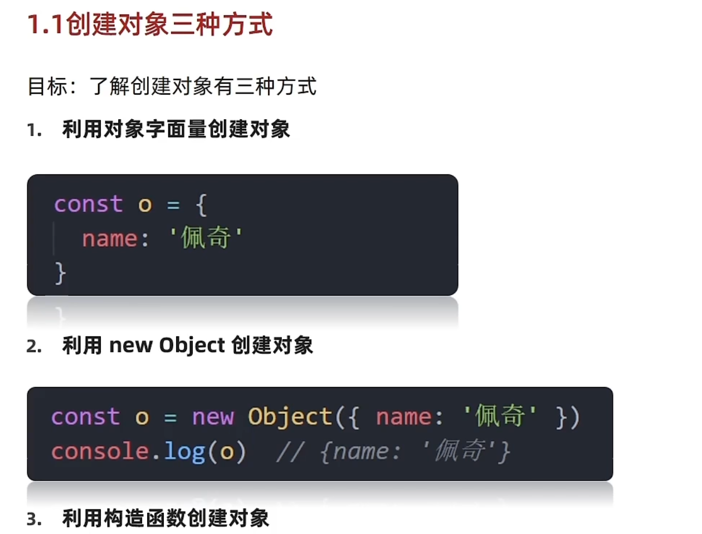

# Day02-深入对象-内置构造函数

## 一.深入对象
### 1.创建对象的三种方式
- 目标：了解创建对象的三种方式
- [创建对象的三种方式](../../../imgs/js/JS进阶/Day02/01-深入对象-创建对象的三种方式.png)
1. 利用对象字变量创建对象
   ```javascript
    const object = {
        name: 'pink'
    }
   ```

2. 利用new object的方式
   ```javascript
    const object new objwct (
        {
            name: 'pink'
        }
    )
   ```

3. 利用构造函数创建对象

### 2.构造函数
- 目标：能够利用构造函数创建对象
- 构造函数是一种特殊的函数，主要用来创建对象
- 使用场景：常规的{...}语法允许创建一个对象，可以通过·构造函数快速批量创建多个类似的对象
- 构造函数的语法：大写字母开头的函数
- 说明
  - 使用new关键字调用函数的行为被称为实例化
  - 实例化构造函数没有参数可以省略，不建议
  - 构造函数内部无需写return，返回值即为新的创建对象
  - 构造函数内部的return返回值无效，所以不要写
  - new Object() new Data()也是实例化构造函数

- 总结
  - 构造函数的作用是什么
    - 构造函数是用来快速创建多个类似的对象
    - 大写字母开头的数
  - new关键字调用函数的行为被称为什么
    - 实例化
  - 构造函数需要写return吗，返回值是什么
    - 不需要
    - 构造函数自动返回创建的新大对象

- 语法
  ```javascript
    //1.创建构造函数
    function object(name) {
        this.name = name
    }
    使用new关键字调用对象
    const o = new object('pink')
  ```

- 构造函数实例化执行过程
- 
- 说明
  1. 创建新的空对象
  2. 构造函数的ths指向新对象
  3. 执行构造函数的代码，修改this，添加新属性
  4. 返回新对象


### 3.实例成员&静态成员
- 实例成员
  - 通过构造函数创建的对象称为实例对象，实例对象种的属性和方法称为实例成员(实例属性和实例方法)
- 说明 
  - 为构造函数传入参数，创建结构相同值不同的对象
  - 构造函数创建的实例对象彼此独立互不影响
- 静态成员
  - 构造函数的属性和方法被称为静态成员(静态属性和静态方法)
- 说明
  - 静态成员只能构造函数来访问
  - 静态方法的this指向构造函数

## 二.内置构造函数
- 在JavaScript的数据类型有6种
- 基本数据类型
  - 字符串 数值 布尔 undefined null
- 引用数据类型
  - null
- 字符串 数值 布尔 等基本类型也有构造函数 称为包装类型
- js中所有的数据都可以基于构造函数创建

- 引用类型
  - Object Array RegExp Data等
- 包装类型
  - String Number Boolean

### 1.Object
- 常用的静态方法(静态方法就是只有构造函数Object可以调用的)

- Object.keys静态方法获取对象中的所有属性(值)
 注意
  - 返回的是一个数组
- 语法
  ```javascript
    const p {name:'pink',age:'18'}
    <!-- 获取对象中的属性值，并且返回数组 -->
    const arr = Object.keys(p)
    console.log(arr)
  ```

- Object.value静态方法获取对象中的所有属性值
- 注意
  - 返回的是一个数组
- 语法
  ```javascript
    const p {name:'pink',age:'18'}
    <!-- 获取对象中的属性值，并且返回数组 -->
    const arr = Object.value(p)
    console.log(arr)
  ```

- Object.assign静态方法获取对象中的所有属性值
- 注意
  - 返回的是一个数组
- 语法
  ```javascript
    const p {name:'pink',age:'18'}
    const arr = {}
    Object.assigin(Object,o)
    console.log(arr)
  ```

### 2.Array

| 方法    | 作用     | 说明                                       |
| ------- | -------- | ------------------------------------------ |
| forEach | 遍历数组 | 不返回数组，经常用于查找遍历数组元素       |
| filter  | 过滤数组 | 返回新数组，返回的是筛选满足条件的数组元素 |
| map     | 迭代数组 | 返回新数组，返回的是处理之后的数组元素     |
| reduce  | 累计器   | 返回累计处理的结果，经常用于求和           |


- 作用reduce返回累计处理结果，经常用于求和

- 如果有初始值，则把初始值累加到里面

- 基本语法
  ```javascript
    arr.(function(上一次值，当前值) {} , 初始值)
  ```

- 执行过程
  1. 如果没有起始值，上一次值以数组的第一个数组的元素值
  
  2. 每一次循环，给返回值给做为下一次循环的上一次值
  
  3. 如果有起始值则起始值做为上一次值

| 常见方法实例方法   | 说明                                                         |
| --------------------------- | ------------------------------------------------------------ |
| join                        | 数组元素拼成字符串，符合字符串                               |
| find                        | 查找元素，返回符合条件的第一个数组元素如果没有符合条件，符合undefined |
| every                       | 检测数组所有元素是否符合指定条件，如果所有元素都通过检测，返回true，否则返回false |
| some                        | 检测数组中所有元素是否满足指定条件。如果数组中元素满足条件返回true，否则返回false |
| concat                      | 合并两个数组，返回新数组                                     |
| sort                        | 对原数组单元值排序                                           |
| splice                      | 删除或替换原数组单元                                         |
| reverse                     | 反转数组                                                     |
| findIndex                   | 查找元素的索引值                                             |

| 常见方法(其他方法) 静态方法   |  说明                                                           |
| --------------------------- | ------------------------------------------------------------ |
|         Array。from()       |              把伪数组转成真数组                                                |

### 3.String
| 常见的实例方法 | 说明 |       
| -------------- | ---- | 
| length | 用来获取字符串的长度 |    
| split('分隔符') | 用来将字符串拆分成数组 |       
| substring(需要截取第一个字符的索引[,结束索引号]) | 用于字符串截取 |      
| startsWith(检测字符串[,检测位置索引号]) | 检测是否以某字符开头 |      
| includes(索引号字符串[,检测位置索引号]) | 判断一个字符是否包含在另一个字符串中，返回值true和false |       
| toLowerCase | 用于字符串转换成小写 |     
| indexOf | 检测是否包含某字符 |       
| endWith | 检测是否以某字符结尾 |      
| relace | 用于替换字符串，支持正则表达式 |      
| mach | 用于查找字符串，支持正则表达式 |      

### 4.Number
- Number是内置构造函数，用来创建数组
- 常用方法
- toFixed()保留小数位数长度
  ```javascript
    <!-- 数组类型 -->
    const  price = 10.08
    <!-- 不写四舍五入 -->
    console.log(price.toFixed())
  ```