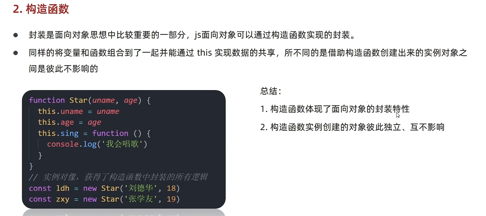
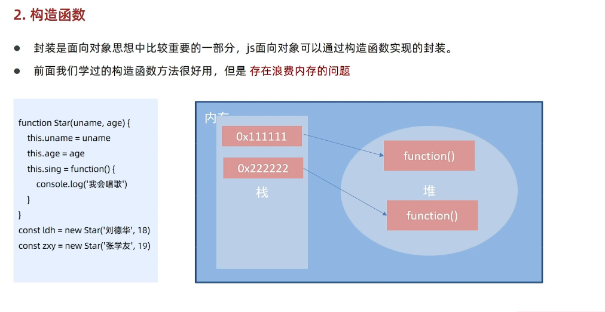
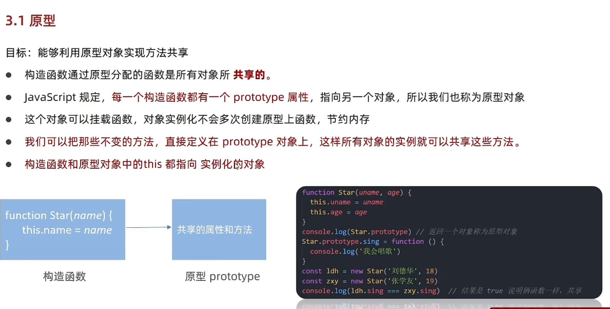
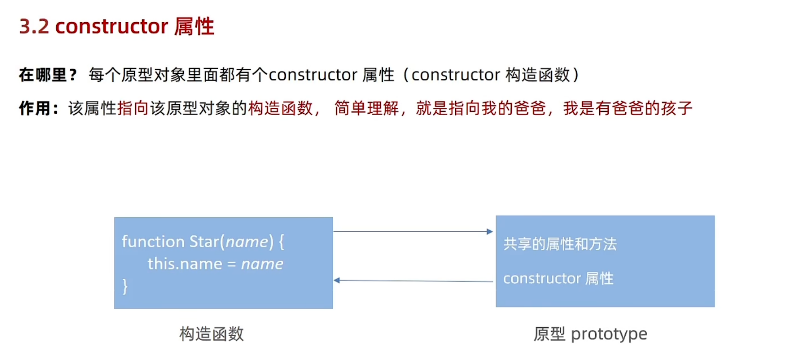
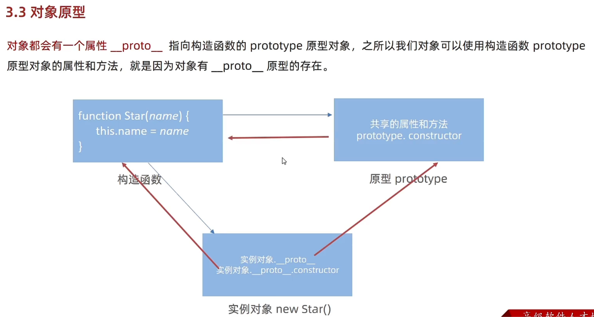
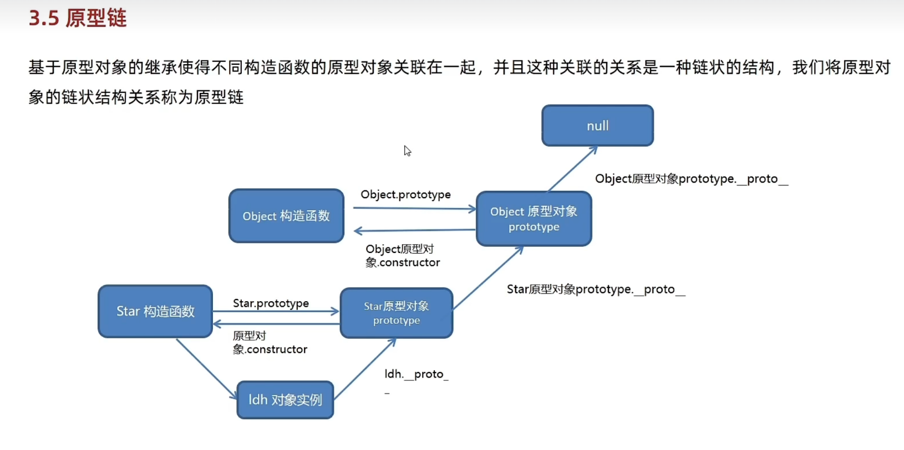
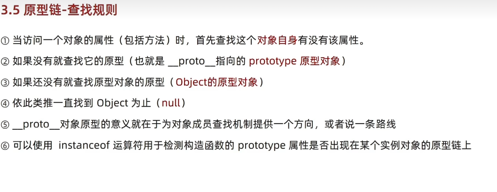

# Day03-深入面向对象-编程思想-构造函数-原型

## 一.编程思想编程
### 1.面向过程编程
- 目标：从实际例子中理解面向过程编程
- 
- 面向过程就是分析出解决问题所需的步骤，然后用函数把这些步骤一步步实现，使用的时候的一次调用即可
- 总结
  - 面向过程，就是按我们分析好的步骤。按步骤解决问题

### 2.面向对象

- 目标：从实际例子理解面向对象编程思想

- 

- 面向对象：是把事务分解成一个个对象，然后由对象之间分工与合作

- 总结
  - 面向对象是以对象功能划分的，而不是步骤

- 在面向对象程序开发思想中，每一个对象都是功能的中心，具有明确分工

- 面向对象编程具有灵活性，代码可复用性，容易维护性和开发的优点，更适合多人合作大型软件项目

- 面向对象的特征
  - 封装性
  - 继承性
  - 多态性

### 3.对比

| 编程思想 | 优点     | 缺点     |
| -------- | ---- | ---- |
| 面向过程思想 | 性能比面向对象高，适合跟硬件联系紧密的东西，例如单片机就采用面向过程思想 | 没有面向对象易维护，易复用，易拓展 |
| 面向对象思想 | 易维护，易复用，易拓展，由于面向对象由封装，继承，多态的特性，可以设计出低耦合的系统，使系统更加灵活易于维护 | 性能比面向过程低 |

## 二.构造函数
- 
- 封装是面向对象重要的思想，JS面向对象可以通过构造函数实现
- 通样的将把变量和函数组合到了一起并能通过this实现数据的共享，不同的借助构造函数创建出来的实例对象之间彼此是不影响的
- 总结
  - 构造函数体现了面向对象封装的特性
  - 构造函数实例创建对象彼此独立，互不影响

- 
- 总结
  - JS实现面向对象借助于谁实现
    - 构造函数
  - 构造函数存在什么问题
    - 内存浪费
## 三.原型
### 1.原型
- 目标：能够利用原型对象实现方法共享
- 
- 构造函数通过原型函数是所有对象所共享的
- JavaScript规定，每一个构造函数都有一个prototype属性，指向另一个对象，所以称为原型对象
- 这个对象可以挂载函数，对象实例化不会多次创建原型上的函数，节约内存
- 我们可以吧不变的方法，直接定义在prototype对象上，这样所有对象上的实例就可以共享这些方法
- 构造函数和原型对象中this指向，实例化对象
- 总结
  - 原型是什么
    - 一个对象，也称prototype为原型对象
  - 原型作用是什么
    - 共享方法
    - 可以把不变的方法，直接定义在prototype对象上
  - 构造函数和原型里this指向谁
    - 实例化对象
### 2.constructor属性 
- 目标：了解constructor属性的作用
- 
- 每一个原型对象里面都有一个constructor(构造函数)属性
- 作用：该属性指向原型对象上的构造函数
- 使用场景：如果有多个对象方法，我们可以给原型对象采取对象形式赋值，这样修改后不在
  指向当前的构造函数，此时，可以添加constructor执行原来的构造函数
- 总结
  - constructor属性作用
    - 指向该原型的构造函数
### 3.对象原型
- 
- 对象都会有一个属性__proto__指向构造函数的prototype原型对象，之所以可以使用构造函数的
  prototype原型对象属性和方法就因为有对象有__proto__原型存在

- 注意
  - __proto__是JS非标准属性
  - [[protope]]和__protope__意义相同
  - 用来表明当前实例对象指向哪个原型对象protope
  - __proto__对象原型里面也有cconstructor属性，指向创建该实例对象的构造函数

- 总结
  - prototype是什么
    - 原型(原型对象)
    - 构造函数自动有原型
  - constrctor属性在哪里，作用
    - prototype原型和对象原型__proto__里面都有
    - 都指向创建实例对象/原型的构造函数
  - __proto__属性在那，指向谁
    - 在实例对象里面
    - 指向原型prototype

### 4.原型继承

### 5.原型链
- 
- 基于原型对象的继承使得不同的构造函数的原型对象关联在一起，并且这关联的关系
  是一种链状结构，我们将原型的链状结构关系称为原型链

- 
- 原型链-查找规则
  1. 当访问一个对象的属性(包括方法)时，首先查找这个对象自身有没有该属性
  2. 如果没有就查找它的原型(也就__proto__指向的prototype原型对象)
  3. 如果还没有就查找原型对象的原型(Object原型对象)
  4. 依次类推一直查找Object为止(null)、
  5. __poto__对象原型的意义就在于为对象成员查找机制提供了一个方向
  6. 可以使用instanceof用于检测构造函数的prototype属性是否出现在某个实例对象的原型链上