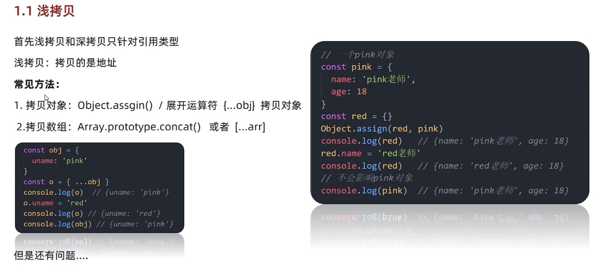
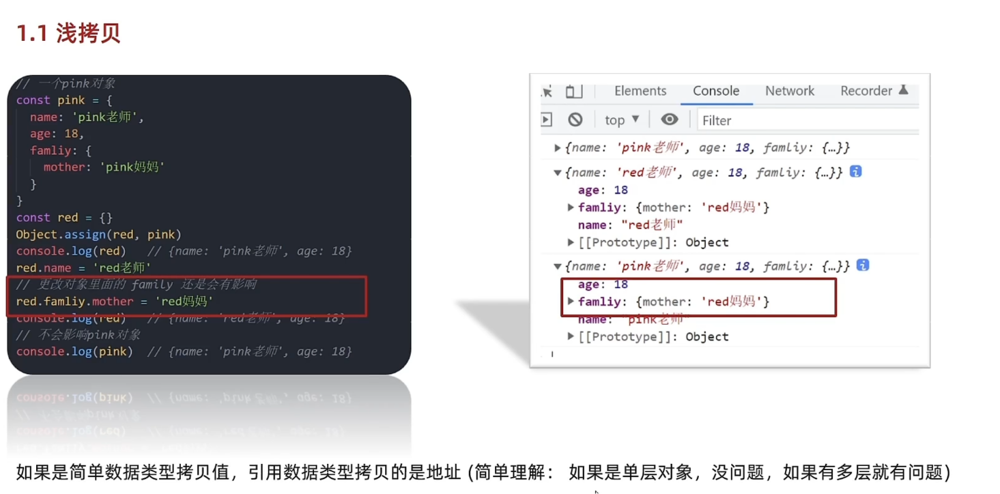
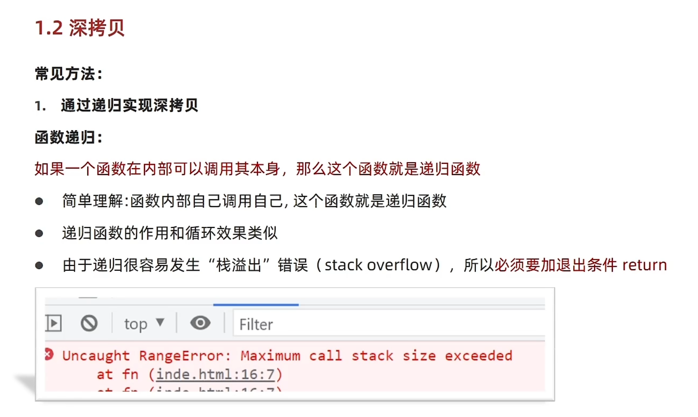
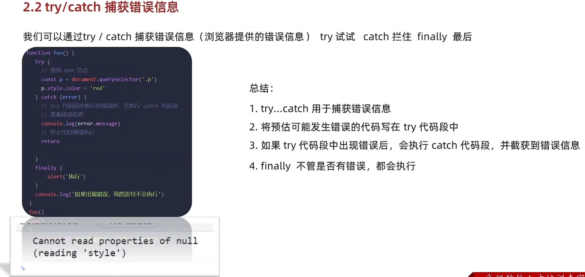
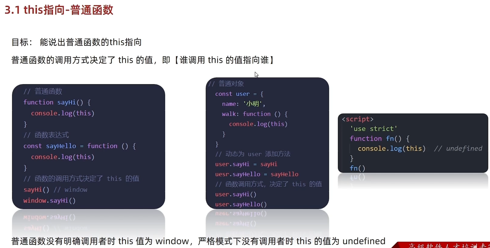
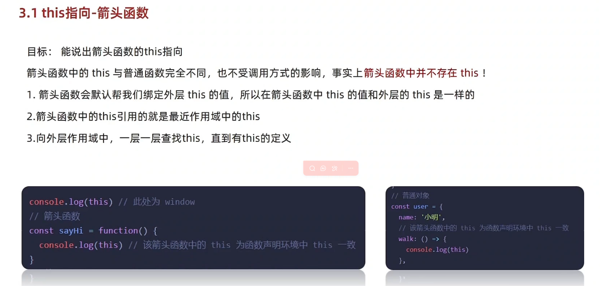
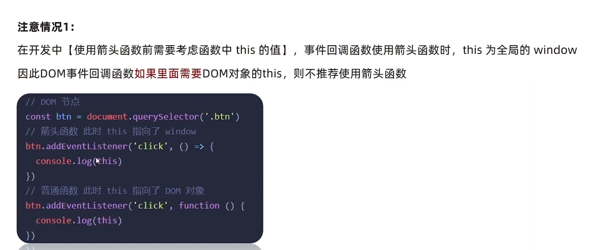
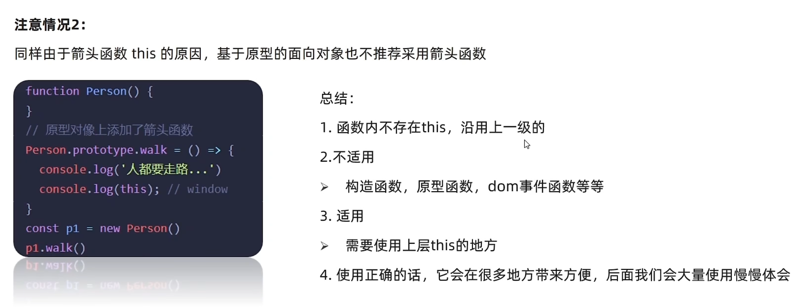

# Day04-d4-高级技巧-深浅拷贝-异常处理-处理this-性能优化

## 一.深浅拷贝
### 1.浅拷贝
- 
- 
- 如果是简单数据类型拷贝的是值，引用数据类型拷贝的地址值(简单理解：如果是单层对象，没有问题，如果有多层有问题) 
- 总结
  - 总结赋值和浅拷贝有什么区别
    - 直接赋值的方法，只要是对象，都会相会影响，因为是直接拷贝对象里面的地址
    - 浅拷贝如果是一层对象，不相互影响，如果出现多层对象拷贝还会相互影响
  - 浅拷贝怎么理解
    - 拷贝对象之后，里面的属性值是简单数据类型直接拷贝值
    - 如果属性值是引用数据类型则拷贝的是地址

### 2.深拷贝
1. 通过递归
- 
- 函数递归
  - 如果函数内部可以调用自己，这函数就是递归函数
  - 递归函数的作用和循环效果类似
  - 因为很容易发生"栈溢出"错误(stack overflow),所以必须加退出条件return
    ```
    1. 深拷贝做到拷贝出来的对象，不会影响旧对象，要想实现深拷贝用到函数递归。
    2. 当进行普通拷贝时，不会有问题，进行赋值就行了，如果是遇到数组的，在次调用递归函数就可以了。
    3. 如果遇到对象形式，在次调用递归。
    4.先Array(数组)后Object(对象)
    ```

---

2. lodash/cloneDeep

3. 通过JSON.stringify() 实现

4. 总结
   - 实现深拷贝的三种方式
     - 利用递归函数实现深拷贝
     - 利用JS库lodash的_.cloneDeep()
     - 利用JSON字符串转换

## 二.异常处理
### 1.throw抛异常
- 
- 异常处理是指预估代码执行过程中可能发生的错误，最大程度的避免错误的发生导致整个程序无法继续运行
- 总结
  - throw抛出异常信息，程序也会终止运行
  - throw后面跟着是错误信息
  - Error对象配合throw使用，能够设置更详细的信息

- 总结
  - 抛出异常用哪个关键字，会终止程序吗
    - throw关键字
    - 会终止程序
  - 抛出异常经常配合谁使用
    - Error对象配合throw使用
### 2.try/catch捕获异常
- 
- 可以通过try-catch捕获错误信息(浏览器提过的错误的信息)try(试试)catch(拦住)finally(最后)
- 总结
  - try...catch用于捕获错误信息
  - 预估可能发生错误的信息的代码写在try代码里
  - 如果try代码段出现错误后，会执行catch代码段，并截获错误信息
  - finally不管是否有错误，都会执行
  - 捕获异常用哪个关键字
    - try-catch-finally
    - try
  - 怎么调用错误信息
    - 利用catch的参数
### 3.debugger

---

## 三.处理this
- 目标：了解函数中this在不同场景下的默认值，知道动态指定函数this值的方法
1. 普通函数this指向
   - 目标：能够说出普通函数this的指向
   - 
   - 普通函数的调用方式决定了this的值，即[谁调用this的值指向谁]，
     普通函数没有明确调用者时，this的值为window,
     严格模式下，没有调用者时，this的值为undefined。
   - 总结
     - 普通数记忆方法
       - [谁调用this的值指向谁]
     - 普通函数严格函数指向谁
       - 严格模式下指向undefined

---

2. 箭头函数this指向
   - 目标：能够说出箭头函数this的指向
   - 
   - 箭头函数里的this与普通函数里的this完全不一样，也不受调用方式的影响，实时上箭头函数中并不存在this
     1.箭头函数会默认绑定外层的this的值，所以在箭头函数中this的值和外层的this是一样的的
     2. 箭头函数this引用的就是最近作用域中的this
     3. 向外层作用域中，一层一层查找this，直到有this定义
   
    - 注意
      - 
      - 
      - 1. 在开发中，[使用箭头函数前需要考虑函数中this的值]，事件回调函数使用箭头函数时，this为
           全局的window，因此DOM事件回调函数，如果里面需要DOM对象的this，不推荐使用箭头函数
        2. 同样由于箭头函数this的原因，基于原型的面向对象也不推荐使用箭头函数 

    - 总结
      - 函数内不存在this沿用上一级的
      - 构造函数，原型函数，DOM事件函数等不适用
      - 需要使用上一级的this的地方
      - 
        
### 1.this指向

### 2.改变this

## 四.性能优化


### 1.节流

### 2.防抖