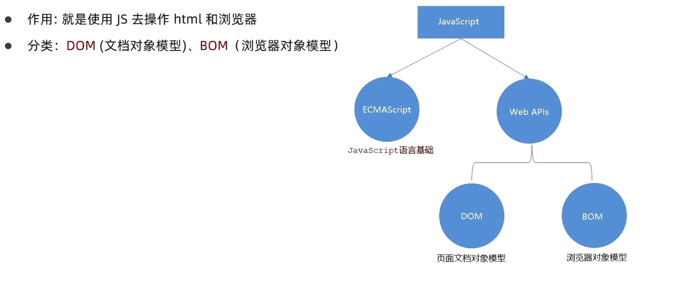
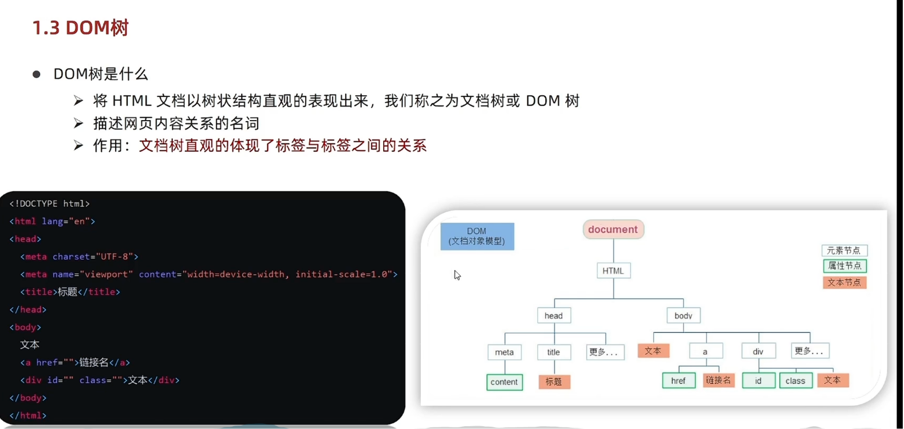
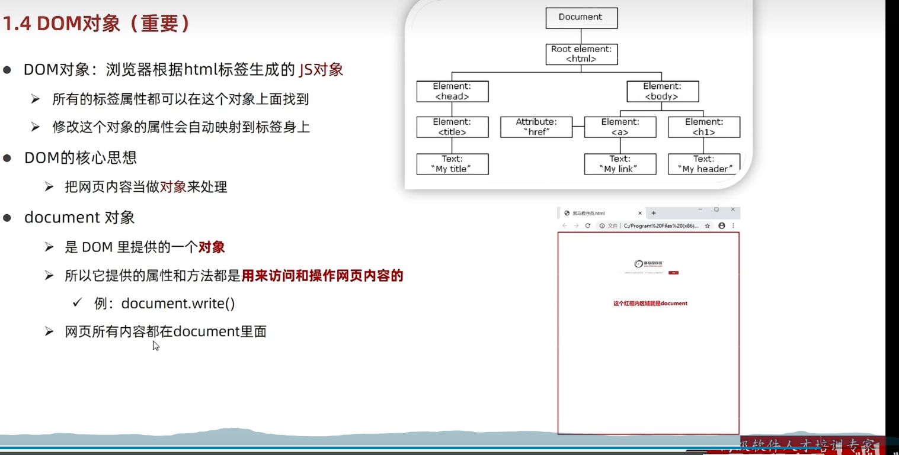
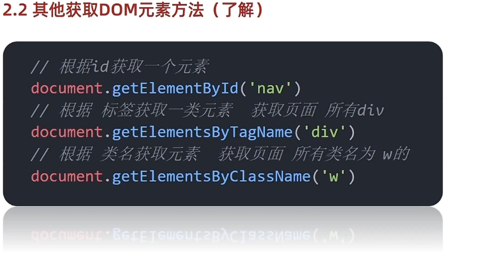

# Day01-d1DOM-获取元素

## 1.WebAPI基础认知
1. 作用和分类
   - 
   - 作用：就是使用js去操作html和浏览器
   - 分类
     - DOM:文档对象模型
     - BOM:浏览器对象模型

2. 什么是DOM
   - DOM(Document Object Model)--文档对象模型是用来呈现以及与任意HTML或XML文档交互的API
   - 简单理解：DOM是浏览器提供的一套专门用来操作网页内容的功能
   - DOM的作用
     - 开发网页内容特效和实现用户交互

3. DOM树
   - 
   - DOM树是什么
     - 将HTML文档以树状图结构直观的表现出来，我们称为文档树或DOM树
     - 描述网页内容关系的名词
     - 作用：文档树直观体现了标签与标签之间的关系

4. DOM对象(重要)  
   - 
   - DOM对象：浏览器根据html标签生成的js对象
     - 所有标签属性都可以在这个对象上找到
     - 修改这个对象的属性会自动映射到标签身上
   - dom的核心思想
     - 把网页内容当作对象来处理
   - document对象
     - 是DOM里提供的一个对象
     - 所以它提供的属性和方法都是用来访问和操作网页内容的
     -网页里的所有内容都在document里
5. 总结
   - DOM树是什么
     - 将HTML文档以树状结构直观的表现出来，我们称为文档树或DOM树
     - 作用：文档树直观的体现了标签与标签之间的关系
   - DOM对象是怎样创建的
     - 浏览器根据HTML标签生成的js对象(DOM对象)
     - DOM的核心就是把内容当对象来处理
   - document是什么
     - 是DOM里提供的一个对象
     - 网页所有内容都在document里面
   

## 2.获取DOM对象
   - 目标:能查找/获取DOM元素
1. 根据CSS选择器来选择DOM(重点)
   - 选择匹配第一个元素
     - 语法
       ```javascript
        document.querySelector('css选择器')
       ```

     - 参数
       - 包括一个或多个有效的css选择器 字符串

     - 返回值
       - CSS选择器匹配第一个元素，一个HTMLElement对象
       - 如果没有匹配返回null

   - 选择匹配多个元素
     - 语法
       ```javascript
        document.querySelectorALL('css选择器')
       ``` 

     - 参数
       - 包含一个或多个有效的CCSS选择器
      
     - 返回值
       - CSS选择器匹配的NodeList对象集合
     
     - ```javascript
      document.querySelectorAll(`CSS选择器`)
      ```

     - 到底的是一个伪数组
       - 有长度有索引的数组
       - 没有pop() push()等数组方法
       - 得到数组元素要用for循环
       - 哪怕只有一个元素，通过quseryScelectAll()获取过来的也是一个伪数组，里面只有一个元素而已

     
      
   - 总结
     - 获取一个DOM元素推荐使用，能直接操作修改吗
       - querySelector()
       - 可以

     - 获取多个DOM元素推荐使用，能直接修改吗，如果不能怎么修改
       - querySelectorAll()
       - 不可以，只能通过遍历方式修改


2. 其他获取DOM元素的方法(了解)
   - 

## 3.操作元素内容
1. 对象.innerText属性
   - 元素innerText属性
     - 将文本内容添加/更换任意标签位置
     - 显示纯文本，不解析标签

2. 对象.innerHTML
   - 将文本内容添加/跟新到任意标签里面
   - 会解析标签，多标签建议使用模板字符

3. 总结
   - 设置/修改DOM元素内容有两种方式
     - 元素.innerText属性
     - 元素.innerHTML属性

   - 三者的区别是什么
     - 元素.innerText属性，只识别文本，不能解析标签
     - 元素.innerHTML属性，能解析文本，能解析标签

## 4.操作元素属性

## 5.定时器-间歇函数

