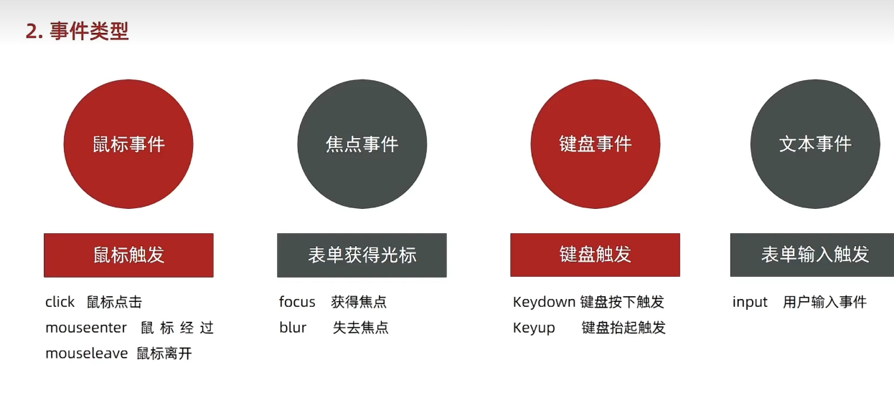

# Day02-d2-事件基础

## 1.事件监听(绑定)

### 1.事件监听
- 目标：能够给DOM元素添加事件监听

- 什么是事件
  - 事件是在编程时系统内发生的动作
  - 比如用用户在网页上单单击一个按钮

- 什么是事件监听
  - 就是让程序检测是否有事件产生，一旦有事件触发，就立即调用一个函数做出响应，
    也称绑定事件或注册事件
  - 比如点击可以播放轮播图等

- 语法
  ```javascript
    元素对象.addEvenListener('事件类型' ， 要执行的函数)
  ```

- 事件监听三要素
  - 事件源：那个DOM元素被事件触发了，要获取DOM元素
  - 事件类型：用什么方式触发，比如鼠标单击click，鼠标经过mouseover等
  - 事件调用函数：要做什么事

- 例
  - 注意
    - 事件类型要加引号
    - 函数是点击之后在执行，每次每次点击都会执行

  ```javascript
    const but = document.querySelector('button')
    //修改元素样式
    btn.addEventListener('click' , function() {
        alert('单击了')
    })
  ```   

- 总结
  - 什么是事件监听
    - 就是让程序检测是否有事件产生，一旦有事件触发
      就立即调用一个函数做出响应，也称为注册事件

  - 事件监听三要素
    - 事件源(谁被触发了)
    - 事件类型(用什么方式触发，是点击还是鼠标经过等)
    - 事件处理程序(要做什么事情)


### 2.拓展阅读-事件监听版本
-拓展-事件监听版本.png)

## 2.事件类型


## 3.事件对象

## 4.环境对象

## 5.回调函数

