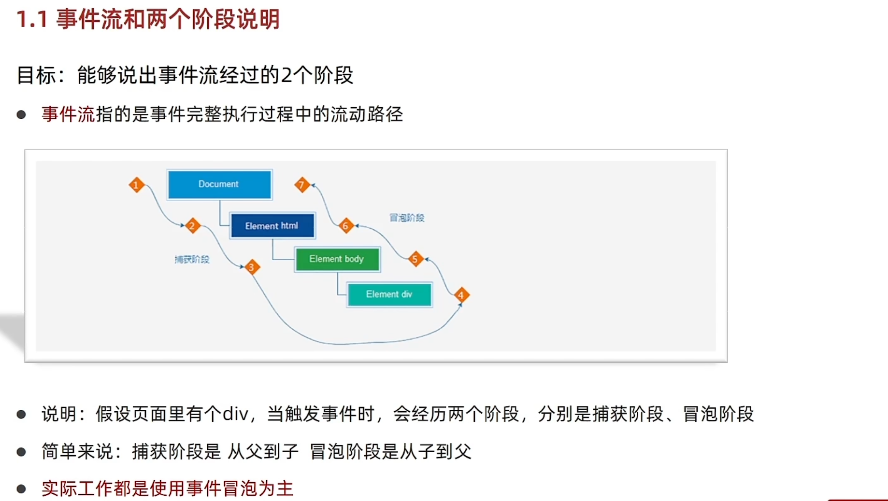
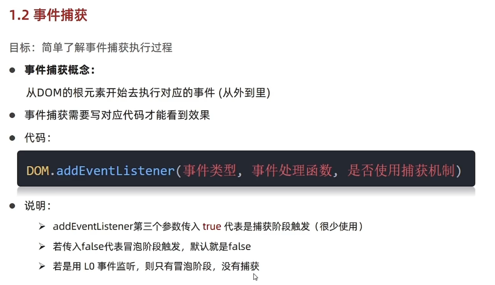
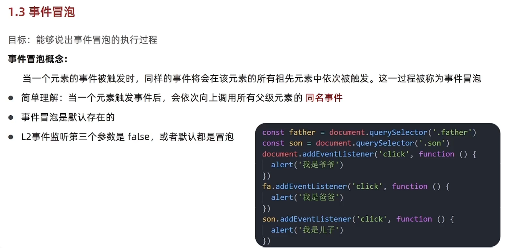
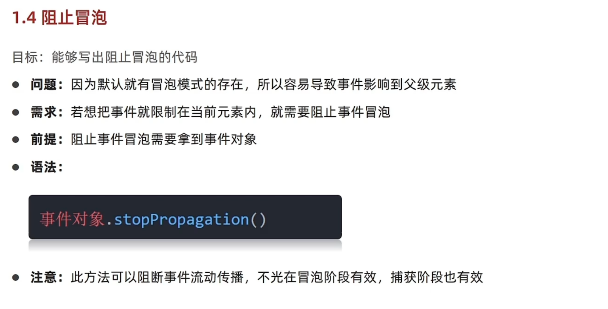
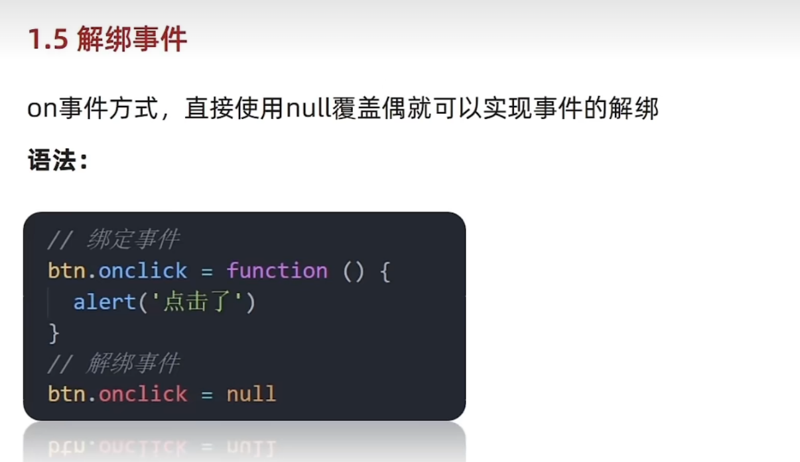
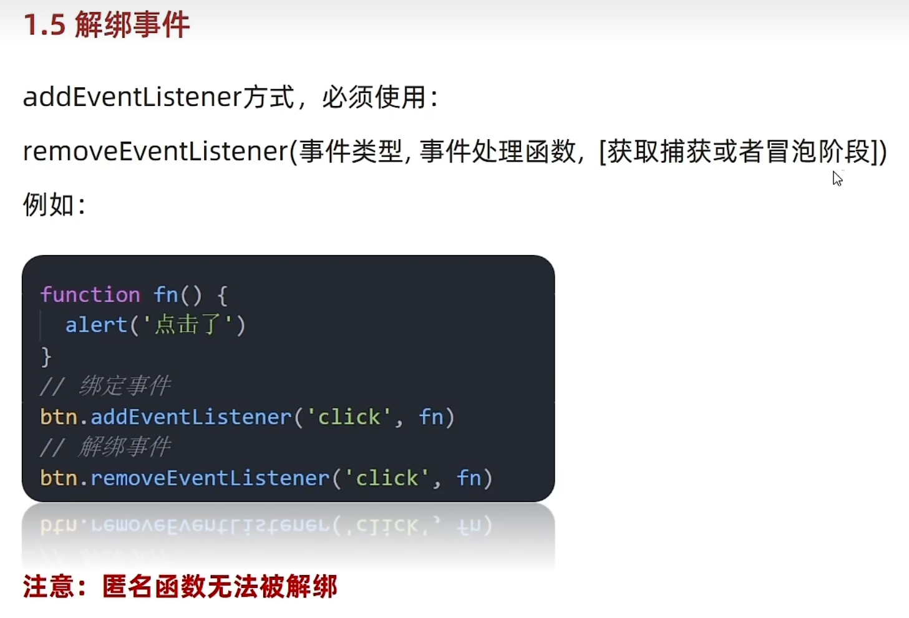

# Day03-事件进阶

## 1.事件流

### 1.事件流与两个进阶声明
- 目标：能够声明事件流经过的2个阶段
- 事件流指的是事件完整执行过程中的流动路径
- 
- 说明：假设页面有个div，当触发事件时，会经过两个阶段，分别是捕获阶段和冒泡阶段
- 简单来说：捕获阶段是从父到子，冒泡阶段是从子到父
- 实际工作都是事件冒泡为主

### 2.事件捕获
- 目标：简单了解事件捕获执行过程
- 
- 事件捕获的概念
  - 从DOM根元素开始去执行对应的事件(从外到里)
- 事件捕获需要写对应代码才能看到效果
- 语法
  ```javascript
    DOM.addEventListener(事件类型， 事件处理函数， 是否使用捕获机制)
  ```
- 说明
  - addEvventListenter第三个参数传入true代表捕获阶段触发(很少使用)
  - 若传入false代表冒泡阶段触发，默认就是false
  - 若要用L0事件监听，则只要冒泡阶段，没有捕获阶段 
### 3.事件冒泡
- 目标：能够说出事件冒泡的执行过程
- 
- 事件冒泡的概念
  - 当有个元素的事件触发时，同样的事件将会在该元素所有的祖先元素中依次被触发，这一过程称为事件冒泡
- 简单理解：当一个元素触发事件后，会依次向上调用所有父级元素的同名事件
- 事件冒泡是默认存在的
- L2事件监听第三个参数是false，或者默认是冒泡
### 4.阻止冒泡
- 目标：能够写出阻止冒泡的代码
- 
- 问题：因为默认就有冒泡模式的存在，所以容易导致事件影响到父级元素
- 需求：若想把事件限制在当前元素内，就需要阻止事件冒泡
- 前题：阻止事件冒泡需要拿到事件对象
- 注意：此方法可以阻断事件流动传播，不光在冒泡阶段有效，捕获阶段也有效
- 语法
  ```javascript
    事件对象.stopPropagtion()
  ```

### 5. 解绑事件
- 传统解绑事件
- 
  - on事件方式，直接使用null覆盖就可以实现解绑事件
  - 语法
    ```javascript
      //绑定事件
      btn.onclick = function ( {
        alert('点击了')
        })
       //解绑事件
      btn.onclck = null
   ```
- 现在解绑事件
  - 
  - addEventListener方式，必须使用
  - removeEventListenter(事件类型， 事件处理函数， [获取捕获或者冒泡阶段])
  - 注意：匿名函数不能解绑
  - 例如
    ```javascript
     //不能用匿名函数
     funtion fn(){
        alert('点击了')
     }
    //绑定事件
     btn.addEventListenter('click' , fn)
     //解绑事件
     btn.removeEventerListener('click' , fn)
    ```
- 两种注册事件的区别
  - 
  - 传统on注册(L0)
    - 同有个对象，后面注册的事件会覆盖前面注册(同有个事件)
    - 直接使用null覆盖就可以实现事件解绑
    - 都是冒泡阶段执行的
  - 事件监听注册(L2)
    - 语法：addEventListenter(事件类型，事件处理函数，是否使用捕获)
    - 可以通过第三个参数去确定是在冒泡或者捕获阶段执行
    - 必须使用removeEventListenter(事件类型，事件处理函数，获取捕获或者冒泡阶段)
    - 匿名函数无法被解绑

## 2.事件委托

## 3.其他事件

## 4.元素尺寸与其他位置