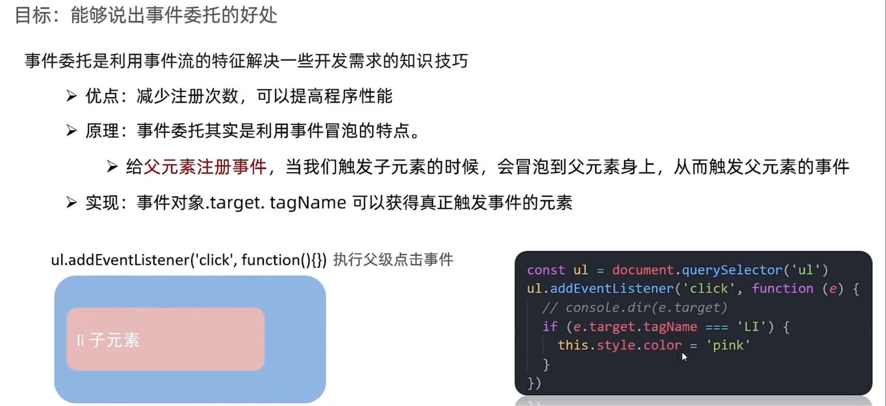

# Day03-事件进阶

## 1.事件流

### 1.事件流与两个进阶声明
- 目标：能够声明事件流经过的2个阶段
- 事件流指的是事件完整执行过程中的流动路径
- 
- 说明：假设页面有个div，当触发事件时，会经过两个阶段，分别是捕获阶段和冒泡阶段
- 简单来说：捕获阶段是从父到子，冒泡阶段是从子到父
- 实际工作都是事件冒泡为主

### 2.事件捕获
- 目标：简单了解事件捕获执行过程
- 
- 事件捕获的概念
  - 从DOM根元素开始去执行对应的事件(从外到里)
- 事件捕获需要写对应代码才能看到效果
- 语法
  ```javascript
    DOM.addEventListener(事件类型， 事件处理函数， 是否使用捕获机制)
  ```
- 说明
  - addEvventListenter第三个参数传入true代表捕获阶段触发(很少使用)
  - 若传入false代表冒泡阶段触发，默认就是false
  - 若要用L0事件监听，则只要冒泡阶段，没有捕获阶段 
### 3.事件冒泡
- 目标：能够说出事件冒泡的执行过程
- 
- 事件冒泡的概念
  - 当有个元素的事件触发时，同样的事件将会在该元素所有的祖先元素中依次被触发，这一过程称为事件冒泡
- 简单理解：当一个元素触发事件后，会依次向上调用所有父级元素的同名事件
- 事件冒泡是默认存在的
- L2事件监听第三个参数是false，或者默认是冒泡
### 4.阻止冒泡
- 目标：能够写出阻止冒泡的代码
- 
- 问题：因为默认就有冒泡模式的存在，所以容易导致事件影响到父级元素
- 需求：若想把事件限制在当前元素内，就需要阻止事件冒泡
- 前题：阻止事件冒泡需要拿到事件对象
- 注意：此方法可以阻断事件流动传播，不光在冒泡阶段有效，捕获阶段也有效
- 语法
  ```javascript
    事件对象.stopPropagtion()
  ```

- 阻止默认行为
  - 语法
    ```
      e.prevenDefault()
    ```

### 5. 解绑事件
- 传统解绑事件
- 
  - on事件方式，直接使用null覆盖就可以实现解绑事件
  - 语法
    ```javascript
      //绑定事件
      btn.onclick = function ( {
        alert('点击了')
        })
       //解绑事件
      btn.onclck = null
   ```
- 现在解绑事件
  - 
  - addEventListener方式，必须使用
  - removeEventListenter(事件类型， 事件处理函数， [获取捕获或者冒泡阶段])
  - 注意：匿名函数不能解绑
  - 例如
    ```javascript
     //不能用匿名函数
     funtion fn(){
        alert('点击了')
     }
    //绑定事件
     btn.addEventListenter('click' , fn)
     //解绑事件
     btn.removeEventerListener('click' , fn)
    ```
- 两种注册事件的区别
  - 
  - 传统on注册(L0)
    - 同有个对象，后面注册的事件会覆盖前面注册(同有个事件)
    - 直接使用null覆盖就可以实现事件解绑
    - 都是冒泡阶段执行的
  - 事件监听注册(L2)
    - 语法：addEventListenter(事件类型，事件处理函数，是否使用捕获)
    - 可以通过第三个参数去确定是在冒泡或者捕获阶段执行
    - 必须使用removeEventListenter(事件类型，事件处理函数，获取捕获或者冒泡阶段)
    - 匿名函数无法被解绑

## 2.事件委托
- 目标：能够说出事件委托的好处
- 
- 事件委托是利用事件流的知识
  - 优点：减少注册此数，提高程序性能
  - 原理：事件委托其实是利用事件冒泡的特点
    - 给父元素注册事件，当我们触发了子元素的时候，会冒泡到父元素身上，从而触发父元素事件
  - 实现：事件对象.targrt.tagNmame可以阵正触发事件元素 

- 总结
  - 事件委托好出是说明
    - 减少注册事件，提高程序性能
  - 事件委托是委托给了谁，父元素还是子元素
    - 父元素
  - 如何找到真正触发的元素
    - 事件对象。target.tarName

## 3.其他事件
### 1.页面加载事件
- 加载外部资源(如图片，外联CSS，外联JS等)加载完毕时，触发事件
- 事件名:load
- 监听页面资源所有加载完毕：
  - 给window添加load事件
- 注意
  - 不仅可以监听整个页面资源加载完毕，也可以针对页面资源绑定load事件  
- 语法
  ```javascript
    windows.addEntListenter('load' , function() {
      //执行操作
    })
  ```
- 当页面的HTML文档被完全加载和解析完之后，DOMContetLoad事件被触发，而
  不用等待样式表，图形等完全加载完成
- 事件名：DOMContentLoaded
- 监听页面DOM加载完毕
  - 给document添加DOMContentLoaded事件
- 语法
  ```javascript
    document.addEventListenter('DOMContentLoaded' , function() {
      //执行的操作
    })
  ```
- 总结
  - 页面加载事件有那两个
    - load事件
      - 监听整个页面资源给window
    - DOMContentLoaded
      - 给document
      - 无需等待样式表，图像等完全加载完

### 2.元素滚动事件
- 滚动条在滚动时时候持续触发事件
- 事件名：scroll
- 给window或document添加scroll事件
- 监听某个元素的内容滚动直接给某个元素即可
- 监听整个页面滚动
  ```javascript
    //页面滚动事件
    window.addEventListenter('scroll' , function() {
      //执行的操作
    })
  ```

- 页面滚动事件-获取位置
  - scrollLeft和scrollTop(属性)
    - 获取被卷去的大小
    - 获取元素内往左，往上滚动出去看不到的距离
    - 这两个值是可读写的

- 使用场景
  - 想要页面滚动一段距离，比如100px，就让某些元素显示

- 开发中经常检测页面滚动距离，，比如页面滚动100px，就可以显示有个元素或者固定有个元素
- 注意：document.documentElement HTML文档返回对象为HTML元素
  ```javascript
    window.addEventListenter('scroll' , function() {
      //document.cocumentElement.scrollTops1是元素获取方式
      const n = document.documentElement.scrollTop
      console.log(n)
    })
  ```

- 总结
  - 被卷去的头部或者左侧用哪个属性，是否可以读取和修改
    - scrollTop/scrollleft
    - 可以读取，也可以修改(赋值)
  - 检测页面滚动的头部距离(被卷去的头部)用哪个属性
    - document.documentElement.scrollTop

### 3.页面尺寸事件
- 会在窗口尺寸改变的时候触发事件
- resize
  ```javascript
    window.addEventListenter('resize' , function() {
      //执行的代码
    })
  ```
- 检测屏幕宽度
  - 语法
   ```javascript
    window.addEventListenter('resize' , function() {
        let w = document.documentElenment.clientwidth
    })
   ```

- 获取宽高
  - 获取元素的可见部分宽高(不包含边框,margin, 滚动条等)
  - clientwidth和clientheight
## 4.元素尺寸与其他位置
- 元素尺寸位置
  - 获取宽高
    - 获取元素的自身宽高,包含元素自生设置的宽高,dadding,border
    - offsetWidth和offsetHeight
    - 获取的是数值,方便计算
    - 注意:获取的是考试宽度,盒子是隐藏的,获取的结过是0
  - 获取位置
    - 获取元素距离自己定位父级元素,左上距离
    - offsetLeft和offsetTop 注意是只读的

- 获取位置
  - element.getBoundingClientRect()
  - 方法返回元素大小及其相当于视口的位置

- 总结
  - offsetwidth和offsetHeight是得到元素的什么宽高
    - 内容 + padding + border
    
  - offsetLeft和offsetTop得到位置以谁为主
    - 带有定位的父级
    
    - 如果都没有则以文档左上角为主
    
      | 属性                      | 作用                                     | 说明                                                   |
      | ------------------------- | ---------------------------------------- | ------------------------------------------------------ |
      | scrollLeft和scrollTop     | 被卷去的头部和左侧                       | 配合也滚动来用，可读写                                 |
      | clientWidth和clientHeight | 获得元素的宽度和高度                     | 不包含border，margin，用于js获取元素的的大小，只读属性 |
      | offsetWidth和offfsetHight | 获得元素的宽度和高度                     | 包含border，padding，滚动条，只读                      |
      | offsetLeft和offsetTop     | 获取元素距离自己定位父级元素的左，上距离 | 获取元素位置时候，只读属性                             |
      
      