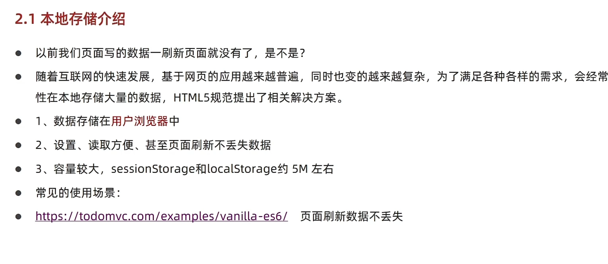
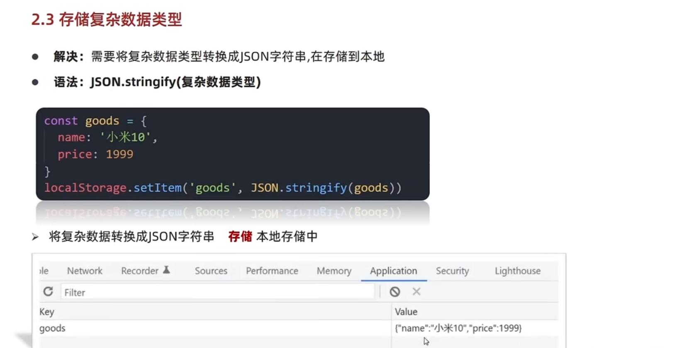
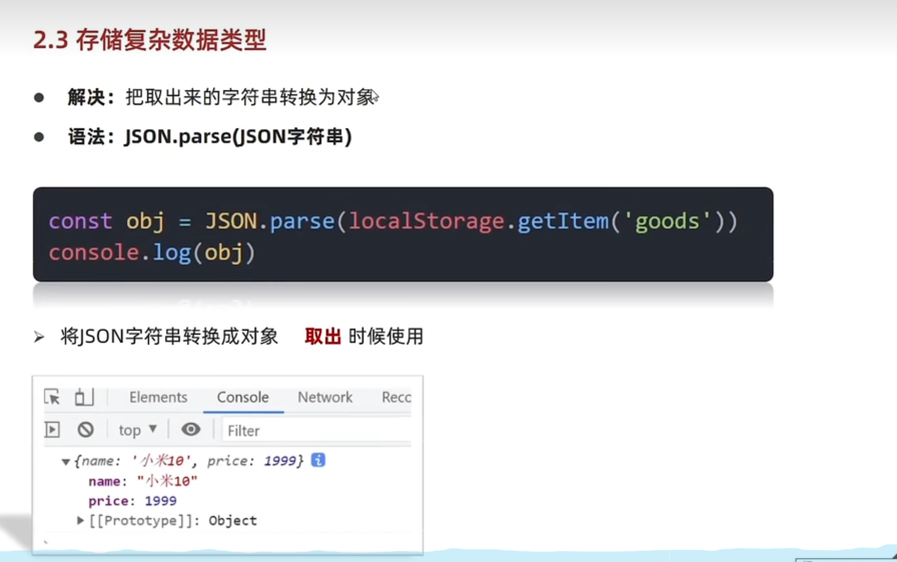

# Day05-d5-BOM-操作浏览器

## 1.Windows对象

### 1.BOM(浏览器介绍)
- 
- BOM(Browser Object Moodel)是浏览器对象模型
- Window对象是一个全局对象,也可说是JavaScript中顶级对象
- 像document aler() console()这些的是window的属性,基本BOM的属性和方法都是window的
- 所有通过var定义在全局作用域中的变量,函数的会变成window对象属性和方法
- windows对象下的属性和方法调用的时候可以省略window

---

### 2.定时器-延迟函数
- js内置的一个用来代码延迟执行的代码,叫setTimeOut
- 语法
  ```javascript
    setTimeout(回调函数 , 延迟毫秒数)
  ```
- setTimeout()仅仅只执行一次.可以理解为把代码一次执行平时省略windows
- 清除延迟函数
  ```javascript
    let time = setTimeout(回调函数 , 等待的毫秒数)
    clearTimeout(time)
  ```

- 注意点
  - 延迟器,需要等待,所以后面的代码先执行
  - 每一次调用延迟器都会产生新的延迟器

---

### 3.JS执行机制
- 
- javaScript语言的一大特点是单线程,也就是说,同一个事件只能做一件事
- 这是因为Javascript这门脚本语言诞生的特点-JavaScript是处理页面中用户操作
  以及操作DOM而诞生的,比如我们对某个DOM元素进行添加删除操作,不能同时进行,应该
  进行添加,然后在删除
- 单线程意味着,所有任务都需要排队,前一个任务执行完毕,才会执行后一个任务,
  导致的问题,如果JS执行的时间过长,这样会造成页面渲染不连贯，导致页面渲染加载阻塞的感觉

---

- 
- 为了解决这个问题，利用多核CPU计算能力，HTML5提出Web Worker标准，允许Javascript脚本创建多个线程
  于是js出现了异步和同步

- 同步
  - 前一个任务结束后在执行后一个任务，程序执行顺序与任务执行顺序是一致的

- 异步
  - 在做一件事件时，因为这个事件会花很长事件，在做这件时的同时，还可以做其他事 

---

- 
- 同步任务
  - 同步任务都在主线程运行，形成一个任务栈
- 异步任务
  - JS异步任务是通过回调函数实现的
  -  一般而言异步任务有一下三类
     - 普通事件 如click，resize
     - 资源加载 如load，error
     - 定时器， 包括setInteval，setTimeout等
- 异步任务相关添加到任务队列中(也称消息队列)

---

- 
- 先执行执行栈的同步代码
- 异任务放到认为队列中
- 一旦执行栈中的所有同步任务执行完毕，系统就会按次序读取任务队列中的异步任务
  于是被读取的异步任务结束等待状态，进入执行栈，开始执行

---

- 

---

### 4.location对象
- lovation的数据类型是对象，它差分并保存URL地址的各个组成部分
- 常用属性和方法
  - href属性获取的完整的URL地址，对齐赋值时是跳转
    ```javascript
      //可以得到当前的URL地址
      const,log(location.href)
      //可以通过js方式进行跳转
      location.href = 'http://www.baidu.com'
    ```

---

  - search属性获取地址中携带的参数，符号? 后面的部分
    ```javascript
      console.log(location.search)
    ```

---

  - hash属性获取地址中的哈希值，符号是#后面的
    ```javascript
      //获取地中的哈希值
      console.log(location.hash)
    ```

---

  - reload方法用来刷新当前页面，传入参数true是表示强制刷新
    ```javascript
    //用来刷新页面 当传入true时表示强制刷新
    location。reload(true)
    ```

---

- 总结
  - location.href属性获取完整的URL地址，对其赋值进行跳转
  - serch属性获取地址中携带的参数，符号?后面的部分
  - hash属性获取地址中的has值，符号#后面的部分
  - reload方法用来刷新当前页面，传入参数true时表示强制刷新
### 5.navigation对象
- 通过uuseAgent检测浏览器版本和平台
  
### 6.history对象
- history的数据练类型是对象主要管理历史记录，该对象对地址栏的操作相对应
  如前进，后退，历史记录等
  
 history对象方法 | 作用                                                       |
 --------------- | ---------------------------------------------------------- |
 back()          | 可以后退的功能                                             |
 forward()       | 前进功能                                                   |
 go(参数)        | 前进后退功能参数，如果是1前进1个页面，如果是-1后退一个页面 |
  
- history对象在实际开发中，比较少用，在一些OV办公系统中见到

## 2.本地存储

### 1.本地存储介绍
- 

---

### 2.本地存储分类
- localStorage
  - 目标能够使用localStorage把数据存储在浏览器中
  - 作用：可以将数据永久存储到本地(用户电脑)，除非手动删除，否则关闭
    页面也会存在
  - 特性：
    - 可以多窗口(页面)共享(同一个浏览器可以共享)   
    - 以键值对的形式存储

- 存储语法
  ```javascript
    localStorage.setItem(key,value)
  ```

- 获取数据
  ```javascript
    localStorage.gwtItem(key)
  ```

- 删除元素
  ```javascript
    localStorage.removeitem(key)
  ```
- sessionStorage
  - 特性：
    - 生命周期为关闭浏览器窗口
    - 在同一个窗口中(页面)下数据可以共享
    - 以键值对形式存储使用
    - 用法根localStorage基本相同

- 总结
  - localStorage作用是什么
    - 可以将数据永久存储在本地(用户电脑)，除非手动删除，否则关闭也会存在
  - localStorage获取，删除的语法是什么
    - 存储：localStorage.setIterm(key , value)
    - 获取：localStorage.getItem(key)
    - 删除：localStorage.removeItem(key)

---

### 3.本地复杂数据存储
- 语法
  ```javascript
    JSON.stringify(复杂数据类型)
  ```

---


---


---

- map()和join()数组方法
  - 使用场景
    - map可以遍历数组处理数据，并且返回新的数组
    - map也称映射，映射是个术语，指两个元素集之间元素相互对应的关系
    - map重点在于有返回值。forEach没有返回值
    - 语法
    ```JavaScript
    const arr = ['pink' , 'red' , 'blue']
    const newArr = arr.map(function(ele , index){
      return ele + '颜色'
    })
    const.log(newArr)
    ```

  - join方法
    - 作用
      - join()方法用于把数组中的所有元素转换为一个字符串
    - 语法
      ```javascript
        const arr = ['pink' , 'blue' , 'red']
        console.log(arr/join(''))
      ```
    - 参数