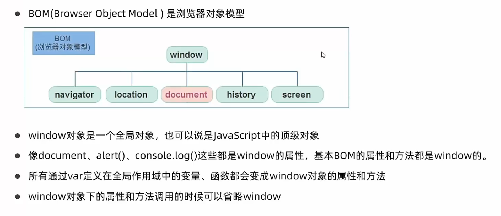
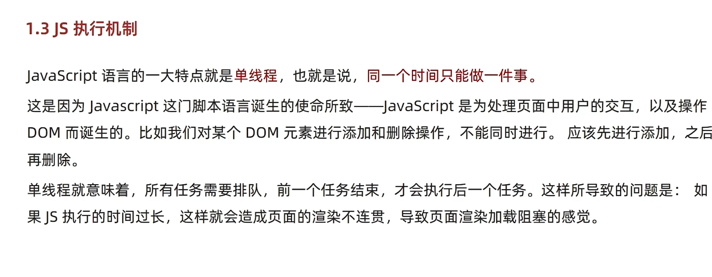
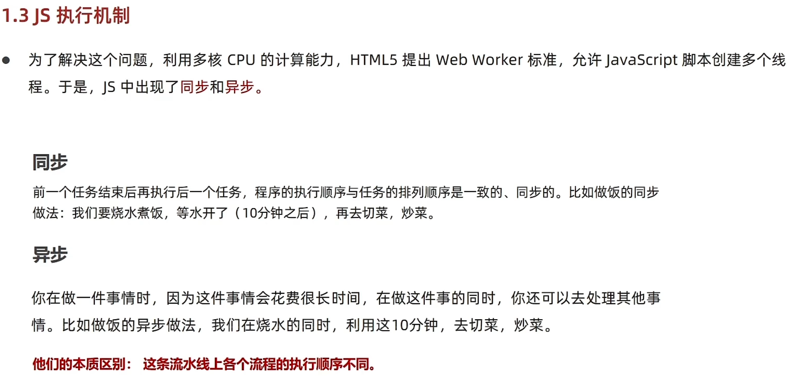
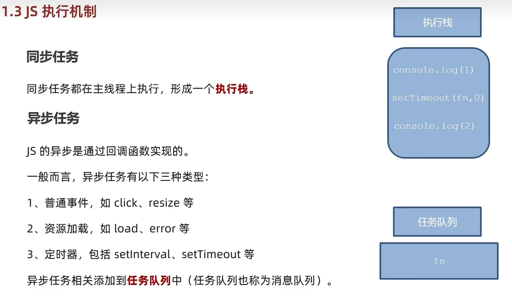
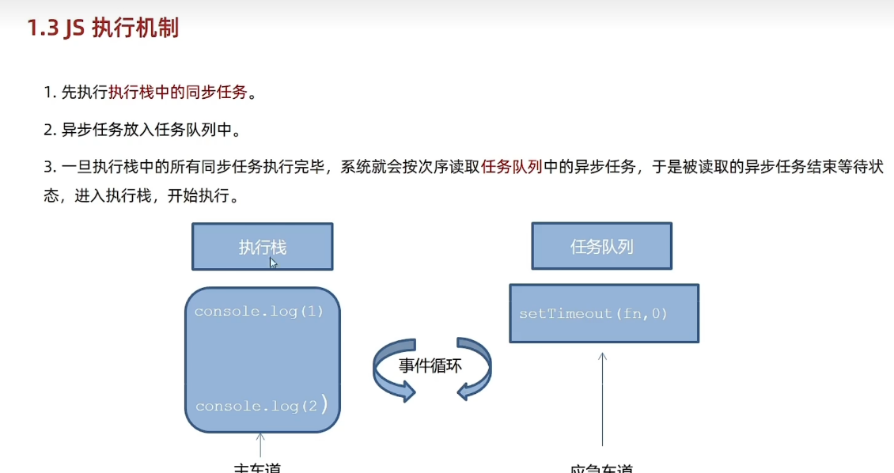
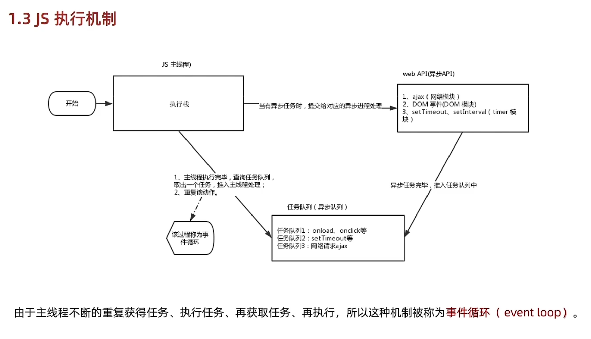

# Day05-d5-BOM-操作浏览器

## 1.Windows对象

### 1.BOM(浏览器介绍)
- 
- BOM(Browser Object Moodel)是浏览器对象模型
- Window对象是一个全局对象,也可说是JavaScript中顶级对象
- 像document aler() console()这些的是window的属性,基本BOM的属性和方法都是window的
- 所有通过var定义在全局作用域中的变量,函数的会变成window对象属性和方法
- windows对象下的属性和方法调用的时候可以省略window

### 2.定时器-延迟函数
- js内置的一个用来代码延迟执行的代码,叫setTimeOut
- 语法
  ```javascript
    setTimeout(回调函数 , 延迟毫秒数)
  ```
- setTimeout()仅仅只执行一次.可以理解为把代码一次执行平时省略windows
- 清除延迟函数
  ```javascript
    let time = setTimeout(回调函数 , 等待的毫秒数)
    clearTimeout(time)
    ```

- 注意点
  - 延迟器,需要等待,所以后面的代码先执行
  - 每一次调用延迟器都会产生新的延迟器


### 3.JS执行机制
- 
- javaScript语言的一大特点是单线程,也就是说,同一个事件只能做一件事
- 这是因为Javascript这门脚本语言诞生的特点-JavaScript是处理页面中用户操作
  以及操作DOM而诞生的,比如我们对某个DOM元素进行添加删除操作,不能同时进行,应该
  进行添加,然后在删除
- 单线程意味着,所有任务都需要排队,前一个任务执行完毕,才会执行后一个任务,
  导致的问题,如果JS执行的时间过长,这样会造成页面渲染不连贯，导致页面渲染加载阻塞的感觉

- 
- 为了解决这个问题，利用多核CPU计算能力，HTML5提出Web Worker标准，允许Javascript脚本创建多个线程
  于是js出现了异步和同步

- 同步
  - 前一个任务结束后在执行后一个任务，程序执行顺序与任务执行顺序是一致的

- 异步
  - 在做一件事件时，因为这个事件会花很长事件，在做这件时的同时，还可以做其他事 

- 
- 同步任务
  - 同步任务都在主线程运行，形成一个任务栈
- 异步任务
  - JS异步任务是通过回调函数实现的
  -  一般而言异步任务有一下三类
     - 普通事件 如click，resize
     - 资源加载 如load，error
     - 定时器， 包括setInteval，setTimeout等
- 异步任务相关添加到任务队列中(也称消息队列)

- 
- 先执行执行栈的同步代码
- 异任务放到认为队列中
- 一旦执行栈中的所有同步任务执行完毕，系统就会按次序读取任务队列中的异步任务
  于是被读取的异步任务结束等待状态，进入执行栈，开始执行

- 
   
### 4.location对象

### 5.navigation对象

### 6.history对象

## 2.本地存储

### 1.本地存储介绍

### 2.本地存储分类

### 3.本地复杂数据存储