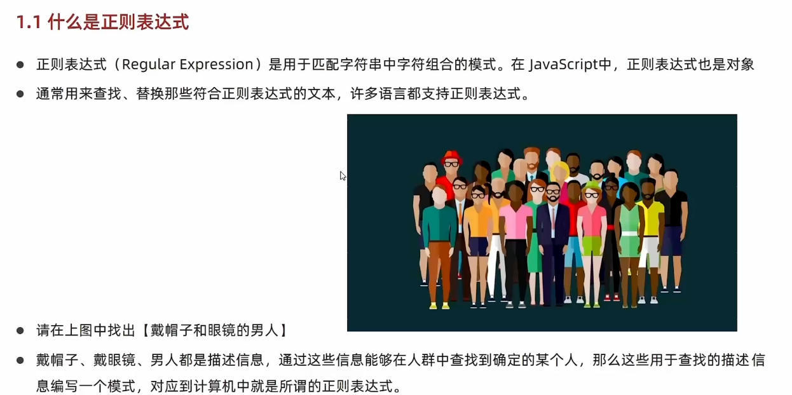
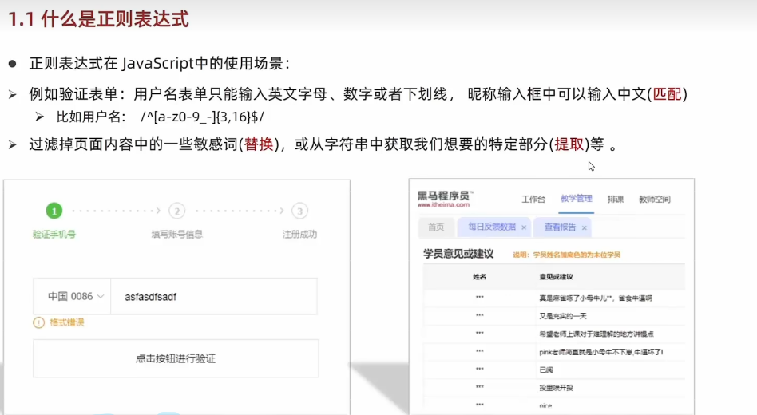
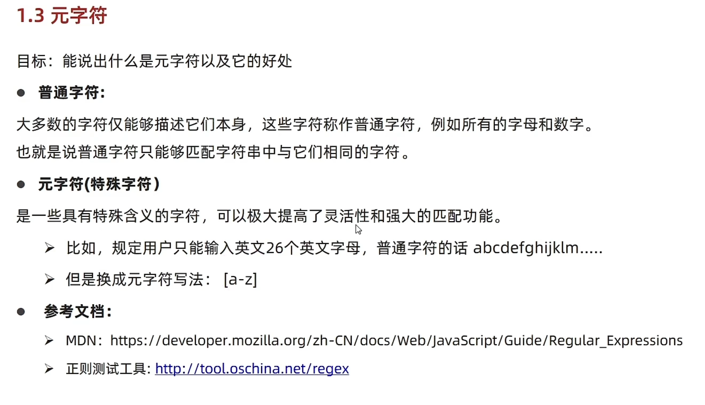

# Day06-d6-正则表达式

## 正则表达式
### 1.介绍
- 什么是正则表达式
  - 
  - 正则表达式()用于匹配字符串中字符组和模式，在js中正则表达式也是一种对象
  - 通常用来查找，替换哪些符合正则表达式文本，许多语言都支持正则表达式

---

- \
- 正则表达式阻止js中使用场景
- 例如：验证表单(匹配)，过滤网页内容的敏感词(替换)， 获取想要的部分(提取)

- 总结
  - 正则表达式是什么
    - 是用于匹配字符串中字符组合模式
  - 正则表达式有什么作用
    - 表单验证(匹配)
    - 过滤敏感词(替换)
    - 字符串提取(提取)

## 2.语法
- 定义语法
  - 在js中定义语法有两种
  - 其中/内容/是正则表达式的字变量
  - 语法
    ```javascript
    const 变量名 = /表达式/
    ```
  - 比如
    ```javascript
    const reg = /前端/
    ```


- 总结
  - 正则表达式使用分为几个步骤
  - 定义正则表达式
  - 检测查找是否匹配

- 使用
- text()
  - text()方法用来查看正则表达式与指定字符串相匹配
  - 如果正则表达式与指定的字符串相匹配，返回true 否则false
  - 语法
    ```javascript
     reg.test(被检测的字符串)
    

- exec()
  - exec()方法在一个指定字符串中执行一个搜索匹配
  - 如果匹配成功exec方法返回的是一个数组

- 总结
  - 正则表达式检测查找tesyt和exec方法有什么区别
    - test方法用于判断是否有符合规则的字符串，符合的是布二只，找到为true 否则为false
    - exec方法用于检索(查找)符合规则的字符串，找到返回一个数组，否则为null

---

### 3.元字符
- 
- 目标：能说出什么是元字符以及它的好处
- 普通字符
  - 大多数的字符字符自能描述他们本身，这些字符称为普通字符，例如所有的字母和数字
  - 也就是说普票字符自能匹配字符串中与他们相同的字符

- 元字符(特殊字符)
- 是一些具备特殊含义的字符，可以极大提高灵活性和强大的匹配功能

- 元字符可以分为几类
  - 边界符(表示位置，开头和结尾，必须用什么开头用什么结尾)、
  - 量词(表示重复次数)
  - 字符类(比如 \d 表示0~9)  

- 总结
  - 什么是元字符
  - 是一些具有特殊含义的字符，可以极大提高灵活性和强大的匹配功能
  - 比如英文的26个英文字母，我们使用元字符[a-z] 简洁和灵活

---

- 分类
  - 边界符
    - 
    
    | 边界符 | 说明                         |
    | ------ | ---------------------------- |
    | ^      | 表示匹配行首的文本(以谁开头) |
    | $      | 表示匹配行首的文本(以谁结束) |
        
    - 正则表达式的边界符(位置符)用于提示字符所处的位置
    
    - 如果^和$在一起，表示必须精确匹配
  ---
       - 例如
         - 
   - 

